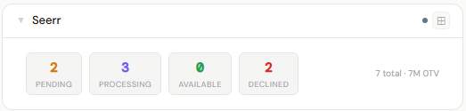
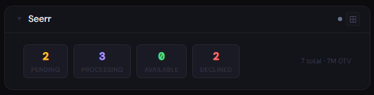
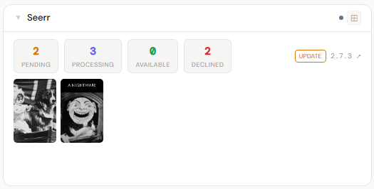
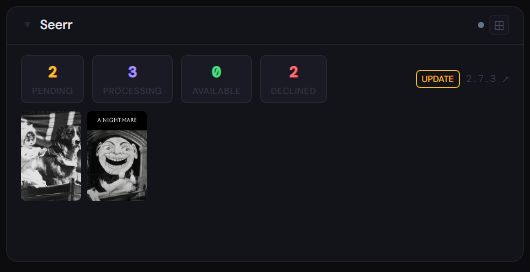
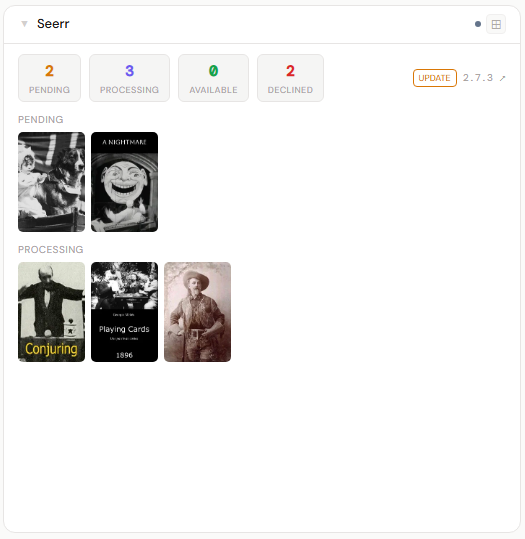
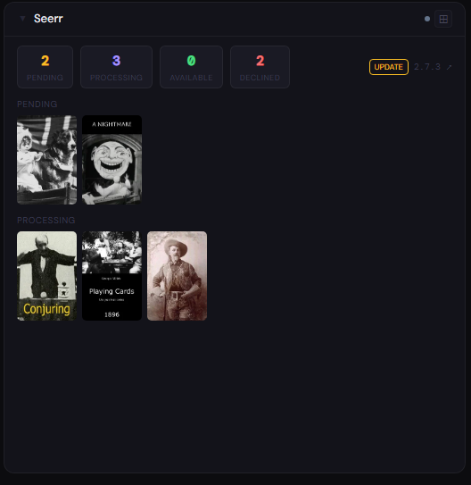

# Overseerr / Jellyseerr

**Category:** Media Management | **Status:** Tested | **Polling:** 5 min

---

## Integration

**Secret format:** Plain API key

> Overseerr → Settings → General → API Key  |  Jellyseerr → same location

**URL required:** Required

**Example URL:** `http://192.168.1.10:5055`

### Setup

1. Overseerr/Jellyseerr → Settings → General → copy API Key
2. Stoa → Admin → Secrets → New: paste the key
3. Stoa → Admin → Integrations → New: select **Overseerr**, enter URL and secret
4. Stoa → Admin → Panels → New: select **Overseerr**

---

## What is Overseerr / Jellyseerr?

Overseerr (Plex) and Jellyseerr (Jellyfin) are request management tools for your media library. Users browse and request movies and TV shows; admins approve, decline, or let auto-approval handle it. Approved requests are handed off to Radarr and Sonarr for downloading.

---

## Panel

Poster filmstrips for every request status — pending approval, being processed, available in your library, and declined — plus lifetime request counts at a glance.

### What's shown

- **Stat chips** — Pending (amber), Processing (blue), Available (green), Declined (red if > 0), total count and movie/TV split
- **Pending filmstrip** — requests waiting for admin approval; posters link to the title in Overseerr
- **Processing filmstrip** — approved requests currently being downloaded by Radarr/Sonarr
- **Available filmstrip** — requests whose media is fully in the library
- **Declined filmstrip** — rejected requests, rendered at reduced opacity to visually distinguish them

### Height behavior

| Height | What you see |
|---|---|
| 1x | Stat chips only — Pending · Processing · Available · Declined · total · M/TV split |
| 2–3x | Stat chips + pending filmstrip |
| 4x+ | Stat chips + filmstrips for Pending → Processing → Available → Declined |

### Screenshots

| | Light | Dark |
|---|---|---|
| **1x** |  |  |
| **2x** |  |  |
| **4x** |  |  |

---

## Notes

- **Works for both Overseerr and Jellyseerr** — use the same integration type; the API is identical
- **Polling and SSE:** Stoa polls every 5 minutes. When the poll completes the result is pushed to all connected browsers via SSE — no manual refresh needed
- **Stat chips are lifetime totals** — they come from Overseerr's `/api/v1/request/count` endpoint which counts all requests ever made, not a sliding window
- **Poster images** come from TMDB via the path returned in Overseerr's request list response. Images are loaded directly from `image.tmdb.org` — no Stoa proxy needed since TMDB poster URLs are public
- **`declined` filter workaround:** Overseerr's request list endpoint does not support `filter=declined`. Stoa fetches all requests with `filter=all` and buckets them by status in the backend, which also reduces API calls from 4 to 1
- **Admin accounts auto-approve:** If you're logged into Overseerr as an admin, your own requests are automatically approved and skip the pending state. Use a non-admin account to generate pending requests for testing
- **API endpoints used:** `/api/v1/status`, `/api/v1/request/count`, `/api/v1/request?filter=all&sort=added&take=200`
