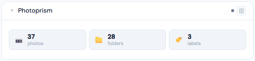
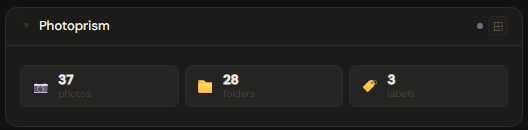
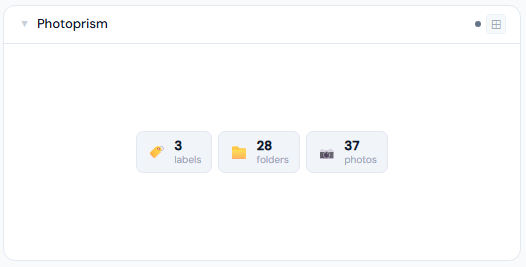
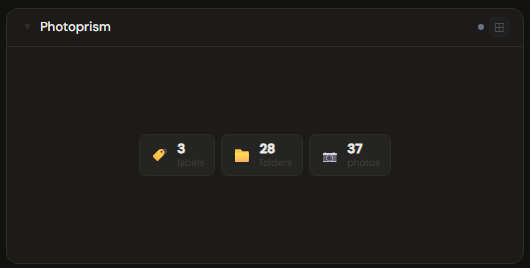
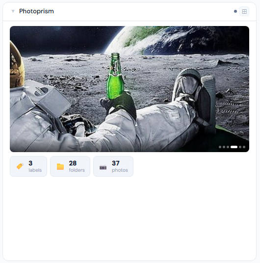
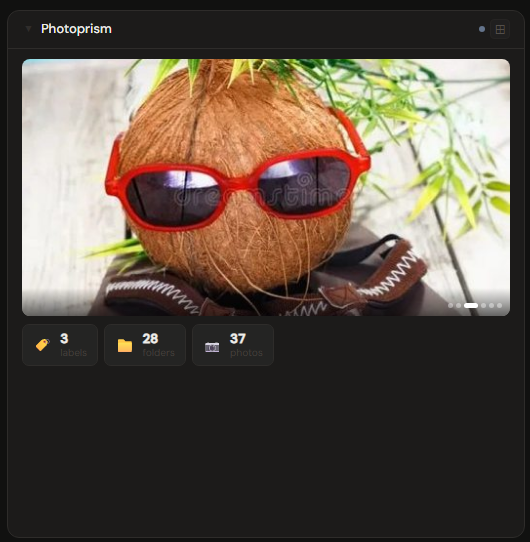

# PhotoPrism

**Category:** Photos & Libraries | **Status:** Tested | **Polling:** 30 min

---

## Integration

**Secret format:** `username:password`

> Your PhotoPrism login credentials. Format: `admin:yourpassword`

**URL required:** Required

**Example URL:** `http://192.168.1.10:2342`

### Setup

1. Format your credentials as `username:password` (e.g. `admin:mypassword`)
2. Stoa → Admin → Secrets → New: paste the formatted credential
3. Stoa → Admin → Integrations → New: select **PhotoPrism**, enter URL and secret
4. Stoa → Admin → Panels → New: select **PhotoPrism**

---

## Panel

Library stats pulled from PhotoPrism's config endpoint, plus a photo preview carousel that cycles through random thumbnails cached daily.

### What's shown

- **Stat tiles** — photos · videos · albums · folders · moments · people · places · labels; only non-zero values appear, so the grid is naturally sized to your library
- **Photo carousel** (4x+) — up to 6 random photos fetched from your library and cached for 24 hours; advances every 4 seconds, pauses on hover, navigable via dot indicators

### Height behavior

| Height | What you see |
|---|---|
| 1x | Up to 4 of the best non-zero stat tiles inline (photos first, then folders, labels, albums, etc.) |
| 2–3x | Full stat grid — all non-zero tiles, wrapping |
| 4x+ | Photo carousel (top) + stat grid (bottom) |

### Screenshots

| | Light | Dark |
|---|---|---|
| **1x** |  |  |
| **2x** |  |  |
| **4x** |  |  |

---

## Notes

- **All stats in one call:** PhotoPrism exposes library counts inside its `/api/v1/config` endpoint — a single request returns photos, videos, albums, folders, moments, people, places, and labels simultaneously
- **Sparse grids:** If your library hasn't been fully indexed (no face recognition, no geo-tagging, no albums created), tiles for people, places, and albums simply won't appear. Run PhotoPrism's indexing pass to populate them
- **Photo carousel:** Thumbnails are fetched via PhotoPrism's tile API using a preview token obtained at login. The token is cached for the session; if it expires, Stoa re-authenticates automatically on the next poll
- **Carousel pre-loading:** All 6 thumbnails are fetched when the panel first expands, stored as in-memory object URLs, and revoked on unmount — no network calls while the slideshow cycles
- **Photo cache:** The random selection is cached for 24 hours per integration. Use the panel's right-click → Refresh to pick a new random set immediately
- **Polling and SSE:** Stoa polls PhotoPrism every 30 minutes. Results are pushed to all connected browsers via SSE — no manual refresh needed
- **API calls per poll:** `/api/v1/session` (login, cached), `/api/v1/config` (all stats + preview token), `/api/v1/photos?order=random` (preview photos, 24h cached)
- **Public instances:** If your PhotoPrism instance has no password set, leave the secret field blank. Stoa will skip authentication and use the public API directly
