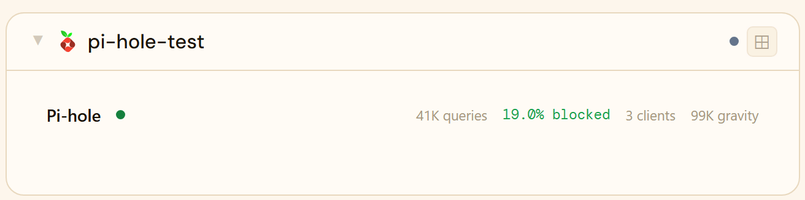
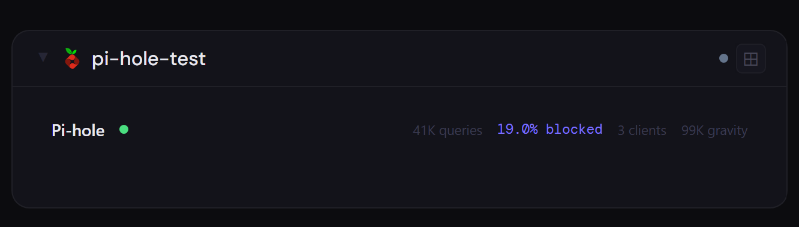
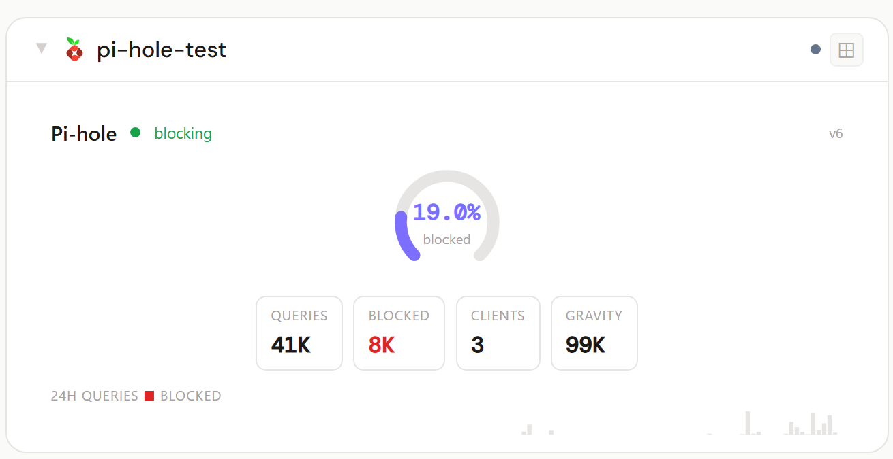
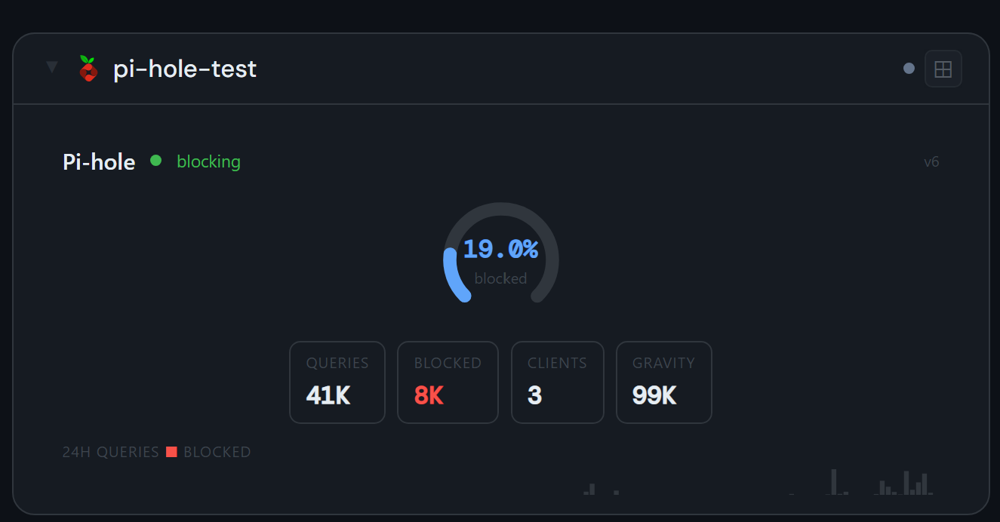
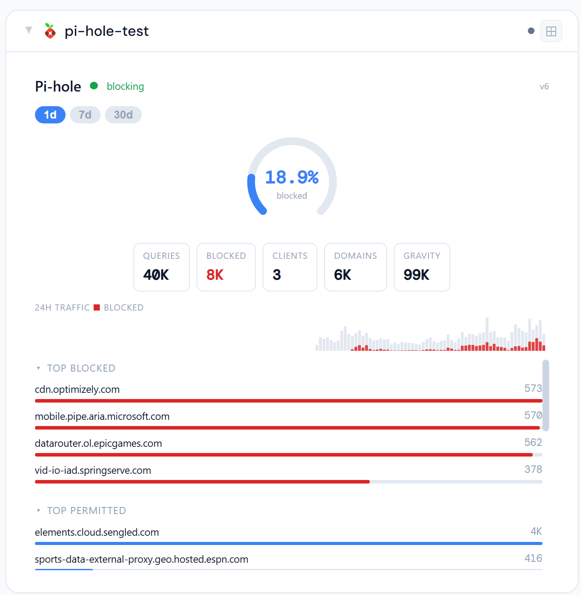
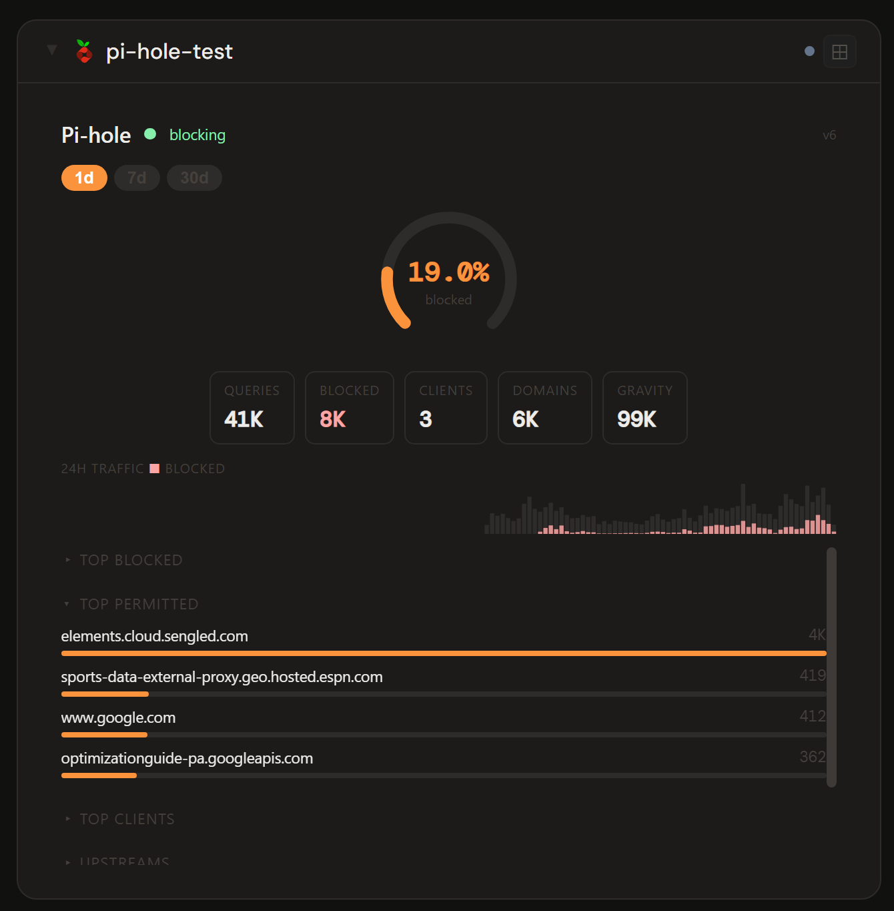

# Pi-hole

## What is Pi-hole?

Pi-hole is a self-hosted, network-wide DNS ad and tracker blocker. It acts as your LAN's DNS resolver, blocking requests to known ad, tracking, and malware domains for every device on the network — no per-device software required — and reports on exactly what it blocked.

**Official site:** [pi-hole.net](https://pi-hole.net)

---

## Getting the key

- **v5:** Pi-hole → **Settings → API / Web interface → Show API token** — copy it.
- **v6:** use your Pi-hole web-UI password (or an app password).

Stoa auto-detects the Pi-hole version at connection time.

- **Secret format:** API token (v5) or web password (v6)
- **URL:** required — point at your Pi-hole, e.g. `http://192.168.1.10`

---

## Add it to Stoa

1. **Admin → Secrets → New** — paste the token (v5) or password (v6).
2. **Admin → Integrations → New** — select **Pi-hole**, enter the URL, choose the secret.
3. **Admin → Panels → New** — select **Pi-hole**.

---

## Panel

DNS query statistics — total queries, blocked percentage, unique clients, gravity size — with a time-range picker (1d/7d/30d), a query timeline, top blocked domains, top permitted domains, top querying clients, upstream resolver distribution, and a blocklist breakdown (per-list domain count and enabled state). The detail sections are individually collapsible so you can keep just what you care about visible.

### Height behavior

| Height | What you see |
|---|---|
| 1x | Query count + blocked % + client count + gravity size |
| 2-3x | Arc gauge + stat chips + sparkline |
| 4x+ | All of the above + time-range picker + top blocked/permitted domains, top clients, upstream resolvers, and blocklists (each collapsible) |

### Screenshots

| | Light | Dark |
|---|---|---|
| **1x** |  |  |
| **2x** |  |  |
| **4x** |  |  |

---

## Notes

**Version auto-detection.** Stoa detects Pi-hole v5 vs. v6 automatically at connection time — nothing to configure. Some v6 builds require authentication even on the version-probe endpoint; Stoa accounts for this transparently.

**Time range.** The 1d view is the default and always reflects the last 24 hours. Wider ranges (7d/30d) depend on how much history your Pi-hole has actually retained (`MAXDBDAYS` setting) — a freshly-installed instance won't have 7 or 30 days of data yet regardless of which range you pick.

**Query types dropped.** An earlier version of this panel showed a DNS query-type breakdown (A/AAAA/PTR/etc.) — it was removed as low-value in practice, in favor of the blocklist breakdown.
