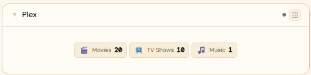
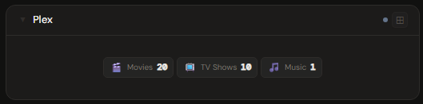
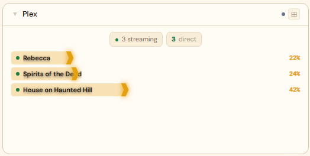
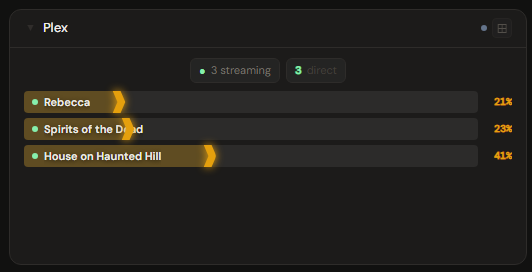
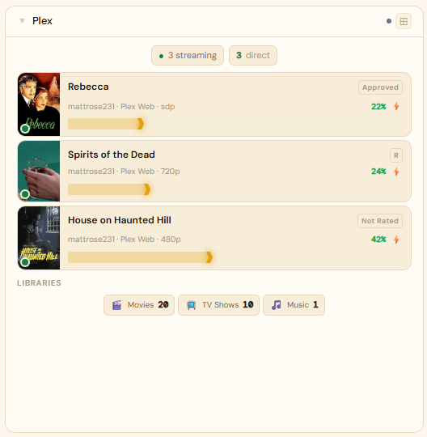
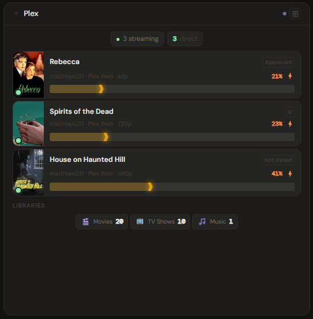

# Plex

**Category:** Media Servers | **Status:** ✅ Tested | **Polling:** 60 s

---

## Integration

**Secret format:** Plex token (`X-Plex-Token`)

> Sign in at plex.tv, open Plex Web in a browser, open DevTools → Network tab, find any `/library` request, and copy the `X-Plex-Token` query parameter. Alternatively: Plex → Settings → Account → (any request header or Plex support article).

**URL required:** Required — point at your Plex Media Server port

**Example URL:** `http://192.168.1.10:32400`

### Setup

1. Retrieve your Plex token (see hint above)
2. Admin → Secrets → New: paste the token
3. Admin → Integrations → New: type `Plex`, URL = `http://plex:32400`, select your secret
4. Admin → Panels → New: type `Plex`, select the integration

---

## Panel

Active stream monitor showing what each user is watching, with transcode/direct-play status, playback progress, and library size breakdown. A server update indicator appears when a newer version of Plex Media Server is available.

### Height behavior

| Height | What you see |
|---|---|
| 1x | Active stream count + currently playing title |
| 2–3x | Stream list with user, title, and progress bars + library counts |
| 4x+ | Full stream detail (client, quality, transcode vs. direct play, bandwidth) + library breakdown by type + update indicator |

### How data flows

On each 60-second poll cycle the backend calls Plex's `/status/sessions` and `/library/sections` endpoints. The full session list and library stats are stored in the backend cache keyed by integration ID — the browser never calls Plex directly.

The panel subscribes to **Server-Sent Events (SSE)**. When the worker refreshes the cache, it broadcasts a `cache-update` event on the integration's SSE channel. The panel receives this signal and updates immediately without a page reload. **Refresh Now** (right-click the panel title bar) triggers an out-of-cycle fetch that pushes fresh data through the same SSE path.

### Screenshots

| | Light | Dark |
|---|---|---|
| **1x** |  |  |
| **2x** |  |  |
| **4x** |  |  |

---

## Notes

- The Plex token is tied to your Plex account, not the server. If you rotate your account password, the token may be invalidated.
- Library section counts include all sections visible to the account associated with the token.
- Update availability is detected by comparing the running version against Plex's release feed.
