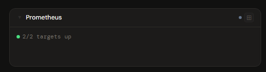
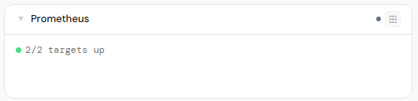
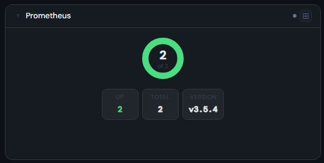
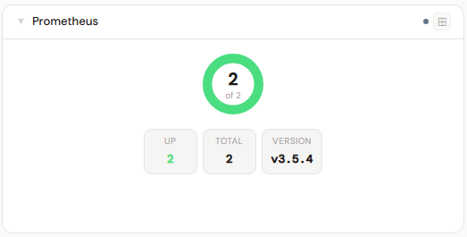
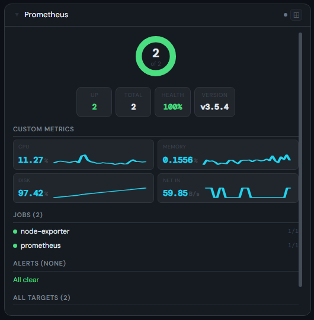
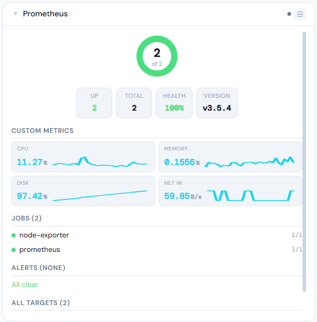

# Prometheus

## What is Prometheus?

Prometheus is an open-source monitoring system and time-series database. It scrapes metrics from your applications and hosts at intervals, stores them, and lets you query them with PromQL and alert on them — the de facto standard for metrics in cloud-native and homelab setups.

**Official site:** [prometheus.io](https://prometheus.io)

---

## Getting the key

Most homelab Prometheus instances run open (no auth) — leave the secret blank. If you added auth via a reverse proxy, use the matching format.

- **Secret format:** blank (open), `username:password` (Basic Auth), or a bare Bearer token
- **URL:** required — point at your Prometheus port, e.g. `http://192.168.1.10:9090`

---

## Add it to Stoa

1. **Admin → Secrets → New** — leave blank, or paste your Basic Auth / Bearer credential.
2. **Admin → Integrations → New** — select **Prometheus**, enter the URL, choose the secret (or none).
3. Optionally add custom PromQL metrics (see below).
4. **Admin → Panels → New** — select **Prometheus**.

---

## Custom PromQL metrics

Custom metric cards are configured on the **integration**, not the panel — this lets the background worker fetch them on the normal 30 s polling cycle. In the integration form, use the **Custom Metrics** editor to add expressions:

| Field | Description |
|---|---|
| Label | Display name shown above the value |
| Query | PromQL expression — use plain `"` in label selectors, not `\"` |
| Unit | Optional suffix appended to the value (e.g. `%`, `MB/s`) |

**Example queries:**

| Metric | Query |
|---|---|
| CPU usage % | `100 - (avg(rate(node_cpu_seconds_total{mode="idle"}[5m])) * 100)` |
| Memory used % | `(1 - (node_memory_MemAvailable_bytes / node_memory_MemTotal_bytes)) * 100` |
| Disk used % | `(1 - (node_filesystem_avail_bytes{mountpoint="/"} / node_filesystem_size_bytes{mountpoint="/"})) * 100` |
| Net receive | `rate(node_network_receive_bytes_total{device!~"lo|veth.*"}[5m])` |

> **PromQL quoting:** Label matcher values use plain double quotes — `{mode="idle"}`, not `{mode=\"idle\"}`. Backslash-escaped quotes are not valid PromQL and will cause HTTP 400 errors.

---

## Panel

Scrape target health by job, active alerting rule status (firing/pending with severity), Prometheus version, and optional custom PromQL metric cards with 60-minute sparklines.

### Height behavior

| Height | What you see |
|---|---|
| 1x | Status dot + N/M targets up + firing/pending alert counts + custom metric values inline |
| 2–3x | Health donut + stat chips (up, down, total, firing, pending, version) |
| 4x+ | Donut → stat chips → custom metric cards (2-per-row) → jobs → alerts → target list |

### Screenshots

| | Dark | Light |
|---|---|---|
| **1x** |  |  |
| **2x** |  |  |
| **4x** |  |  |

---

## Notes

- Custom metric cards each display the current instantaneous value, optional unit, and a 60-minute sparkline (30 data points at 2-minute resolution). Multiple series from a single query are summed.
- The target list in 4x+ shows all targets when all are healthy; switches to down-only when any target is down.
- Alerts shown are firing and pending only — inactive rules are excluded.
