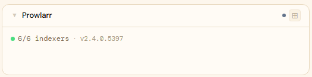
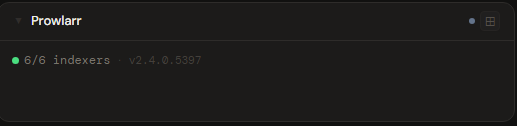
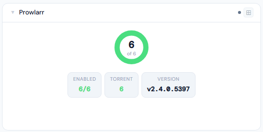
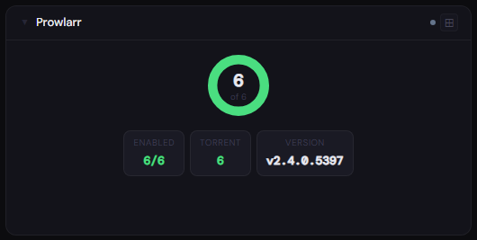
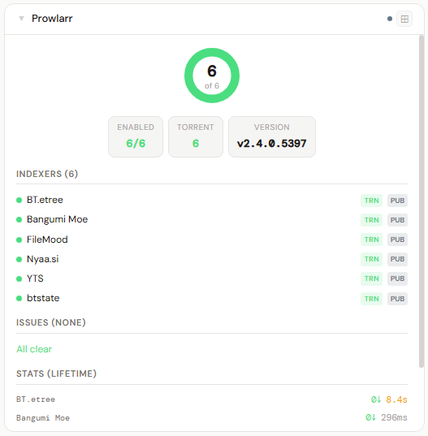
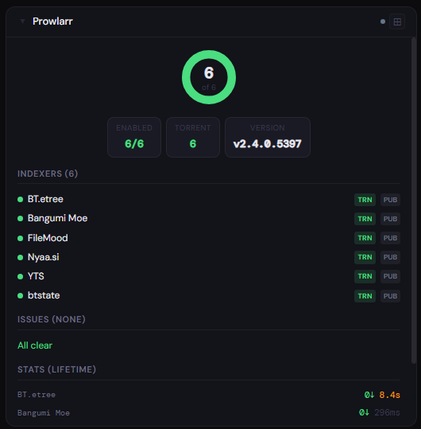

# Prowlarr

**Category:** Media Management | **Status:** Tested | **Polling:** 60 s

---

## Integration

**Secret format:** Plain API key

> Prowlarr → Settings → General → Security → API Key

**URL required:** Required

**Example URL:** `http://192.168.1.10:9696`

### Setup

1. Prowlarr → Settings → General → copy API Key
2. Stoa → Admin → Secrets → New: paste the key
3. Stoa → Admin → Integrations → New: select **Prowlarr**, enter URL and secret
4. Stoa → Admin → Panels → New: select **Prowlarr**

---

## What is Prowlarr?

Prowlarr is an indexer manager and proxy for the \*arr ecosystem. It connects to torrent and usenet indexers and exposes them to Sonarr, Radarr, Lidarr, and other apps through a unified API — so you manage your indexers in one place instead of configuring each one per app.

---

## Panel

Indexer health donut, per-indexer grab counts and response times, connected \*arr app sync status, and system health alerts.

### What's shown

- **Donut chart** — healthy vs. total enabled indexers; color shifts green → amber → red as failures accumulate
- **Stat chips** — Enabled count, Failing count (if any), Torrent count, Version
- **Indexers** (4x) — full roster sorted by health: blocked → degraded → ok → disabled; each row shows health dot, privacy badge (PUB/SEMI/PVT), protocol badge (TRN/NZB), name, and lifetime grab count
- **Issues** (4x) — Prowlarr system health alerts (same source as the bell icon in Prowlarr's UI)
- **Lifetime stats** (4x) — per-indexer grabs, average response time, and failed query rate for indexers that have been queried

### Height behavior

| Height | What you see |
|---|---|
| 1x | Health dot · enabled/total indexers · failing count · health issues · lifetime grabs · version |
| 2–3x | Health donut centered · stat chips (Enabled, Failing, Torrent, Version) |
| 4x+ | Donut + chips → full indexer list → health issues → lifetime stats per indexer |

### Screenshots

| | Light | Dark |
|---|---|---|
| **1x** |  |  |
| **2x** |  |  |
| **4x** |  |  |

---

## Notes

- **Polling and SSE:** Stoa polls Prowlarr every 60 s. When the poll completes, the result is pushed to all connected browsers via SSE — the panel updates automatically without a page refresh
- **Indexer health detection:** `blocked` = Prowlarr has auto-blocked the indexer with a future `disabledTill` timestamp; `degraded` = a recent failure is recorded but the indexer is not yet blocked; `ok` = healthy; `disabled` = manually disabled in Prowlarr
- **Lifetime stats are query-dependent:** The stats column (grabs, response time, fail rate) is populated by Prowlarr only after indexers have been searched. Newly added indexers will show no stats until Prowlarr routes a search through them
- **Public indexers require no keys:** EZTV, YTS, Nyaa, 1337x, and similar public torrent indexers can be added in Prowlarr without an account or API key — Stoa picks them up automatically on the next poll
- **Connected apps:** If you have Sonarr, Radarr, or other \*arr apps wired to Prowlarr (Prowlarr → Settings → Apps), the 4x panel shows each connected app's name and sync level (Full Sync, Add Only, Disabled)
- **API endpoints used:** `/api/v1/system/status`, `/api/v1/health`, `/api/v1/indexer`, `/api/v1/indexerstats`, `/api/v1/application`
