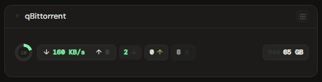
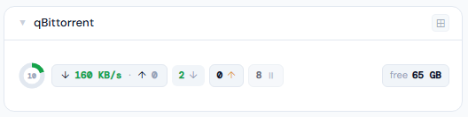
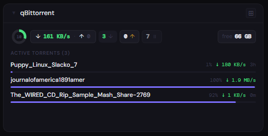
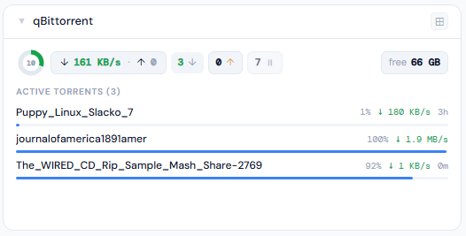
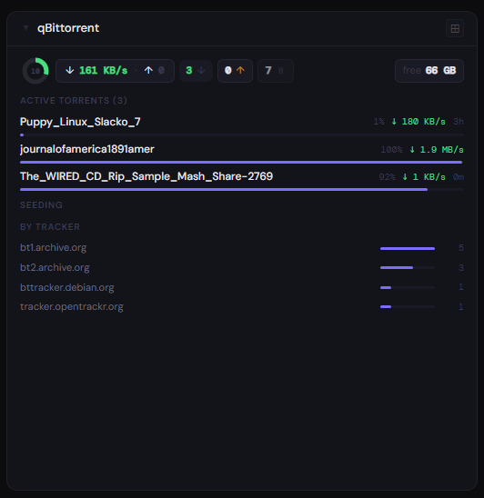
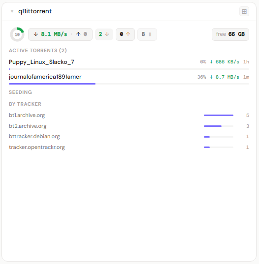

# qBittorrent

**Category:** Downloads | **Status:** ✅ Tested | **Polling:** 30 s

---

## Integration

**Secret format:** API key (recommended) or `username:password`

> **API key — qBittorrent 5.2.0+ (recommended):** Preferences → Web UI → API Key → Generate. The key starts with `qbt_`. Paste the key alone (no colon). Sent as `Authorization: Bearer <key>` — no login session required.
>
> **Username:password:** Your qBittorrent WebUI credentials. Default is `admin:adminadmin` (change it). Format as `username:password`. Stoa logs in via `POST /api/v2/auth/login` and caches the `SID` cookie, refreshing automatically on expiry.

**URL required:** Required

**Example URL:** `http://192.168.1.10:8080`

### Setup

1. Admin → Secrets → New: paste your API key (e.g. `qbt_abc123...`) or `username:password`
2. Admin → Integrations → New: type qBittorrent, URL = `http://qbittorrent:8080`, select secret
3. Admin → Panels → New: type qBittorrent, assign to the integration

### How it works

Stoa uses the **qBittorrent Web API v2**. Three endpoints are called per poll:

- `GET /api/v2/torrents/info` — full torrent list with state, speed, progress, size, ETA, tracker, and ratio
- `GET /api/v2/transfer/info` — aggregate download/upload speeds
- `GET /api/v2/sync/maindata` — free space on disk (via `server_state.free_space_on_disk`)

**API key auth (5.2.0+):** The key is sent as `Authorization: Bearer <key>` on every request. No session or login needed.

**Username:password auth:** Stoa calls `POST /api/v2/auth/login` with `Referer` and `Origin` headers (required by qBittorrent's CSRF protection since 4.6). The returned `SID` cookie is cached and reused. If a request returns HTTP 403/401, the SID is cleared and a fresh login is attempted. Note: qBittorrent may temporarily ban an IP after repeated failed logins.

Tracker hostnames are extracted from the `tracker` field (announce URL) and parsed to hostname only.

Updates arrive via SSE push every 30 seconds.

---

## Panel

Torrent state donut, aggregate speeds, per-state counts, active torrent list, seeding list, and tracker breakdown.

### Height behavior

| Height | What you see |
|---|---|
| 1x | State donut + speed pill (↓/↑) + per-state count pills (downloading, seeding, paused, checking, errored) + free space |
| 2–3x | 1x summary + **Active Torrents (N)** list — name, progress bar, speed, ETA or ratio — up to 6 items |
| 4x+ | 2x content + **Seeding (N)** list (amber dot if uploading, name, upload speed, color-coded ratio) + **By Tracker** bar chart |

**Ratio coloring:** green ≥ 1.0 · amber ≥ 0.5 · dim < 0.5

qBittorrent state mapping: `downloading`/`forceDL`/`metaDL` → downloading · `uploading`/`forceUP`/`stalledUP`/`queuedUP` → seeding · `pausedDL`/`pausedUP`/`stalledDL`/`queuedDL`/`moving` → paused · `checkingDL`/`checkingUP`/`checkingResumeData` → checking · `error`/`missingFiles` → errored.

ETA values ≥ 8,640,000 seconds (qBittorrent's "infinity" sentinel of 100 days) are displayed as ∞.

### Screenshots

| | Dark | Light |
|---|---|---|
| **1x** |  |  |
| **2x** |  |  |
| **4x** |  |  |
