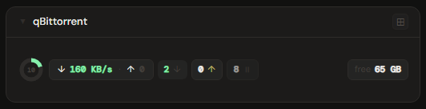
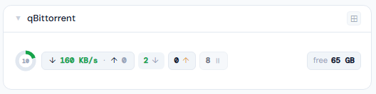
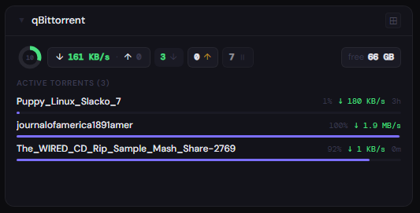
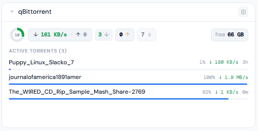
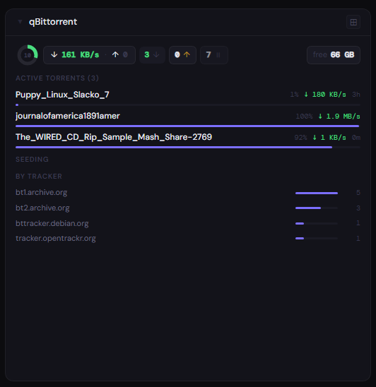
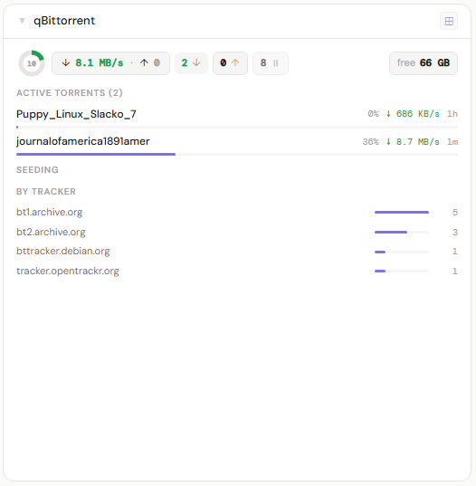

# qBittorrent

## What is qBittorrent?

qBittorrent is a free, open-source BitTorrent client with a full-featured web UI, built-in search, RSS auto-downloading, and no ads. A popular open alternative to older clients, it's frequently run headless on a server.

**Official site:** [qbittorrent.org](https://www.qbittorrent.org)

---

## Getting the key

- **API key (qBittorrent 5.2.0+, recommended):** Preferences → Web UI → API Key → **Generate**. The key starts with `qbt_`. Paste it alone (no colon) — it's sent as `Authorization: Bearer <key>`, no login session needed.
- **Username:password:** your qBittorrent WebUI credentials (default `admin:adminadmin` — change it). Stoa logs in via `/api/v2/auth/login` and caches the session cookie.

- **Secret format:** API key (recommended) or `username:password`
- **URL:** required — point at your qBittorrent port, e.g. `http://192.168.1.10:8080`

---

## Add it to Stoa

1. **Admin → Secrets → New** — paste the API key (e.g. `qbt_abc123...`) or `username:password`.
2. **Admin → Integrations → New** — select **qBittorrent**, enter the URL, choose the secret.
3. **Admin → Panels → New** — select **qBittorrent**.

---

## How it works

Stoa uses the **qBittorrent Web API v2**. Three endpoints are called per poll:

- `GET /api/v2/torrents/info` — full torrent list with state, speed, progress, size, ETA, tracker, and ratio
- `GET /api/v2/transfer/info` — aggregate download/upload speeds
- `GET /api/v2/sync/maindata` — free space on disk (via `server_state.free_space_on_disk`)

**API key auth (5.2.0+):** the key is sent as `Authorization: Bearer <key>` on every request — no session or login needed.

**Username:password auth:** Stoa calls `POST /api/v2/auth/login` with `Referer` and `Origin` headers (required by qBittorrent's CSRF protection since 4.6). The returned `SID` cookie is cached and reused; on a 403/401 the SID is cleared and a fresh login attempted. (qBittorrent may temporarily ban an IP after repeated failed logins.)

Tracker hostnames are parsed from the announce URL. Updates arrive via SSE push every 30 seconds.

---

## Panel

Torrent state donut, aggregate speeds, per-state counts, active torrent list, seeding list, and tracker breakdown.

### Height behavior

| Height | What you see |
|---|---|
| 1x | State donut + speed pill (↓/↑) + per-state count pills (downloading, seeding, paused, checking, errored) + free space |
| 2–3x | 1x summary + **Active Torrents (N)** list — name, progress bar, speed, ETA or ratio — up to 6 items |
| 4x+ | 2x content + **Seeding (N)** list (amber dot if uploading, name, upload speed, color-coded ratio) + **By Tracker** bar chart |

**Ratio coloring:** green ≥ 1.0 · amber ≥ 0.5 · dim < 0.5

qBittorrent state mapping: `downloading`/`forceDL`/`metaDL` → downloading · `uploading`/`forceUP`/`stalledUP`/`queuedUP` → seeding · `pausedDL`/`pausedUP`/`stalledDL`/`queuedDL`/`moving` → paused · `checkingDL`/`checkingUP`/`checkingResumeData` → checking · `error`/`missingFiles` → errored.

ETA values ≥ 8,640,000 seconds (qBittorrent's "infinity" sentinel of 100 days) are displayed as ∞.

### Screenshots

| | Dark | Light |
|---|---|---|
| **1x** |  |  |
| **2x** |  |  |
| **4x** |  |  |
