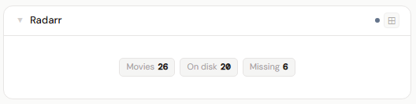
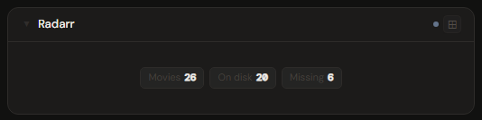
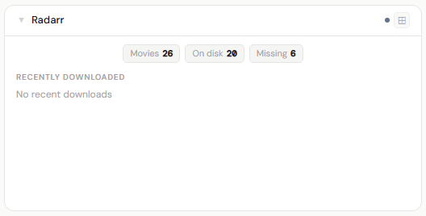
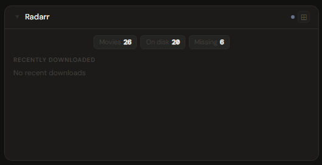
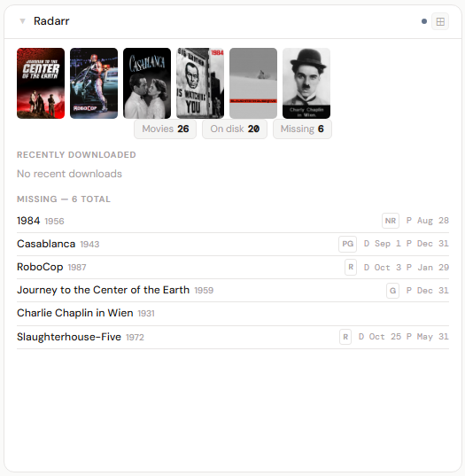
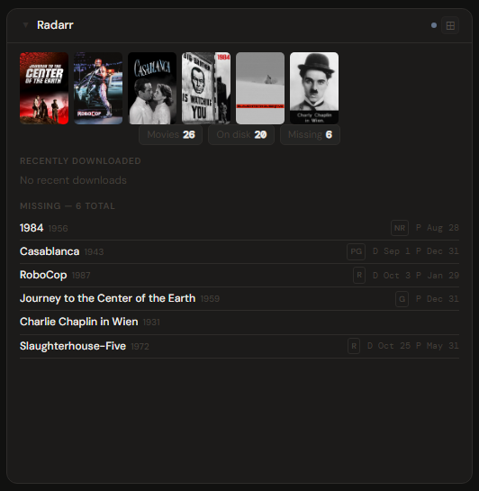

# Radarr

**Category:** Media Management | **Status:** ✅ Tested | **Polling:** 30 min

---

## Integration

**Secret format:** Plain API key

> Radarr → Settings → General → Security → API Key

**URL required:** Required — point at your Radarr port

**Example URL:** `http://192.168.1.10:7878`

### Setup

1. Radarr → Settings → General → copy the API Key
2. Admin → Secrets → New: paste the key
3. Admin → Integrations → New: type `Radarr`, URL = `http://radarr:7878`, select your secret
4. Admin → Panels → New: type `Radarr`, select the integration

---

## Panel

Movie library overview with recently downloaded films, a wanted/missing list, and library stats (movies / on disk). A poster artwork filmstrip appears at 4x.

### Height behavior

| Height | What you see |
|---|---|
| 1x | Stat chips: movie count · on disk count |
| 2x | Stat chips + recent download history + wanted/missing movies |
| 4x+ | Poster artwork filmstrip + stat chips + recent history + wanted list |

### Artwork filmstrip (4x+)

The 4x filmstrip shows poster artwork for recently downloaded movies and movies you want but don't have yet (missing from disk). This "want + got" view gives an at-a-glance picture of recent library activity alongside titles still on your list. Posters are fetched from Radarr through Stoa's **image proxy** (`/api/images/proxy`), so your Radarr instance does not need to be publicly accessible.

### Content rating filter

An optional `allowedRatings` config field accepts a comma-separated list of ratings (e.g. `G,PG,PG-13`). When set, only movies whose Radarr rating matches appear in the filmstrip and missing sections.

### How data flows

On each 30-minute poll cycle the backend calls:

| Endpoint | Data retrieved |
|---|---|
| `GET /api/v3/history` | Recently grabbed/imported movies with poster URLs |
| `GET /api/v3/movie` | Full library — movie counts, on-disk status, poster URLs |

All data is cached by integration ID. The browser never calls Radarr directly, and poster artwork is served through Stoa's image proxy — Radarr's internal URLs are never exposed to the browser.

The panel subscribes to **Server-Sent Events (SSE)**. When the worker refreshes the cache, it broadcasts a `cache-update` event on the integration's SSE channel. The panel updates automatically without a page reload.

### Screenshots

| | Light | Dark |
|---|---|---|
| **1x** |  |  |
| **2x** |  |  |
| **4x** |  |  |

---

## Notes

**Calendar:** Radarr release dates appear on the Calendar panel. Add Radarr as a calendar source in Profile → Calendar Sources.

**Missing sample:** The wanted list shows a random sample that re-shuffles on each data refresh.
