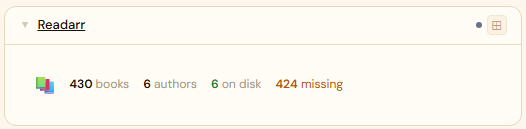
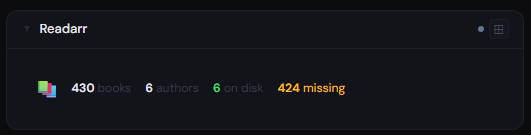
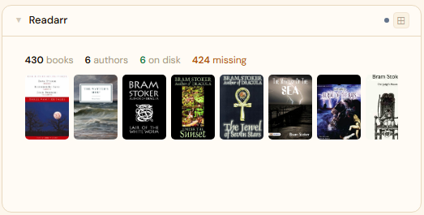
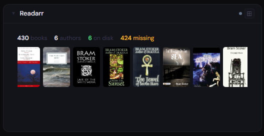
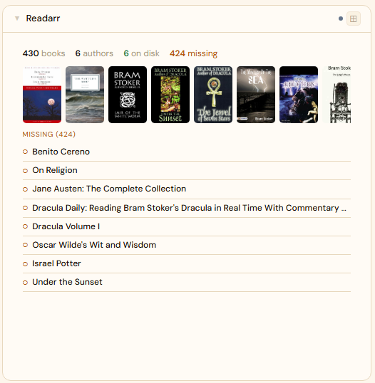

# Readarr

**Category:** Media Management | **Status:** ✅ Tested | **Polling:** 30 min

---

## Integration

**Secret format:** Plain API key

> Readarr → Settings → General → Security → API Key

**URL required:** Required — point at your Readarr port

**Example URL:** `http://192.168.1.10:8787`

### Setup

1. Readarr → Settings → General → copy the API Key
2. Admin → Secrets → New: paste the key
3. Admin → Integrations → New: type `Readarr`, URL = `http://readarr:8787`, select your secret
4. Admin → Panels → New: type `Readarr`, select the integration

---

## Panel

Book and audiobook library overview with upcoming release schedule, recently downloaded titles, missing/wanted books, and library stats (authors / books / on disk).

### Height behavior

| Height | What you see |
|---|---|
| 1x | Stat chips: book count · on disk count |
| 2x | Stat chips + upcoming releases + recent download history |
| 4x+ | Full schedule + stat chips + recent history + wanted/missing list |

### How data flows

On each 30-minute poll cycle the backend calls Readarr's calendar, history, and book/author list endpoints. All data is cached by integration ID — the browser never calls Readarr directly.

The panel subscribes to **Server-Sent Events (SSE)**. When the worker refreshes the cache, it broadcasts a `cache-update` event on the integration's SSE channel. The panel updates automatically without a page reload.

### Screenshots

| | Light | Dark |
|---|---|---|
| **1x** |  |  |
| **2x** |  |  |
| **4x** |  |  |

---

## Notes

**Calendar:** Readarr release dates appear on the Calendar panel. Add Readarr as a calendar source in Profile → Calendar Sources.
