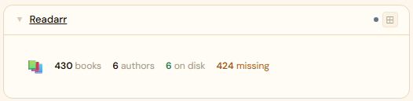
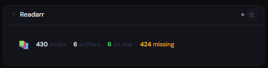
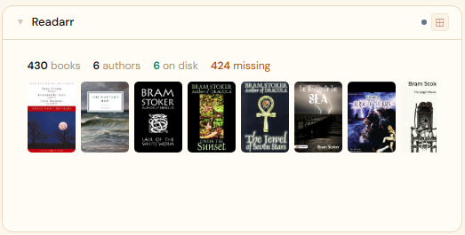
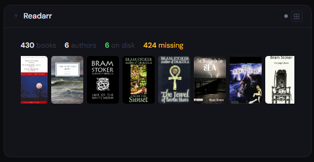
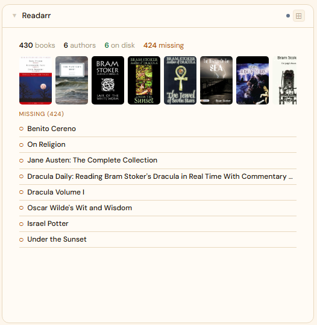

# Readarr

## What is Readarr?

Readarr is an ebook and audiobook collection manager in the "\*arr" family. It follows the authors and books you want, grabs matching releases from your usenet and torrent indexers, hands them to your download client, and organizes them into your library. (Note: the Readarr project was retired by its maintainers in 2024 — existing installs keep working, but it's no longer actively developed.)

**Official site:** [readarr.com](https://readarr.com)

---

## Getting the key

Readarr → **Settings → General → Security → API Key** — copy it.

- **Secret format:** plain API key
- **URL:** required — point at your Readarr port, e.g. `http://192.168.1.10:8787`

---

## Add it to Stoa

1. **Admin → Secrets → New** — paste the API key.
2. **Admin → Integrations → New** — select **Readarr**, enter the URL, choose the secret.
3. **Admin → Panels → New** — select **Readarr**.

---

## Panel

Book and audiobook library overview with upcoming release schedule, recently downloaded titles, missing/wanted books, and library stats (authors / books / on disk).

### Height behavior

| Height | What you see |
|---|---|
| 1x | Stat chips: book count · on disk count |
| 2x | Stat chips + upcoming releases + recent download history |
| 4x+ | Full schedule + stat chips + recent history + wanted/missing list |

### How data flows

On each 30-minute poll cycle the backend calls Readarr's calendar, history, and book/author list endpoints. All data is cached by integration ID — the browser never calls Readarr directly.

The panel subscribes to **Server-Sent Events (SSE)**. When the worker refreshes the cache, it broadcasts a `cache-update` event on the integration's SSE channel. The panel updates automatically without a page reload.

### Screenshots

| | Light | Dark |
|---|---|---|
| **1x** |  |  |
| **2x** |  |  |
| **4x** |  |  |

---

## Notes

**Calendar:** Readarr release dates appear on the Calendar panel. Add Readarr as a calendar source in Profile → Calendar Sources.
