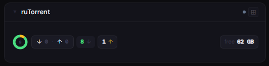
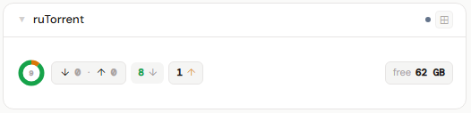
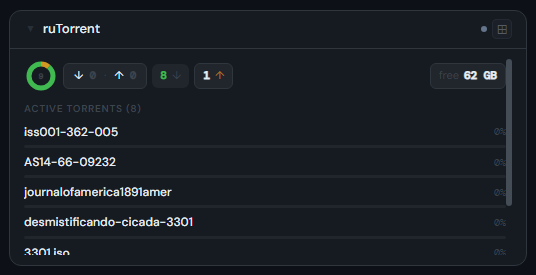
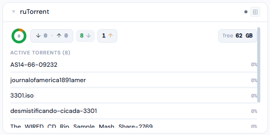
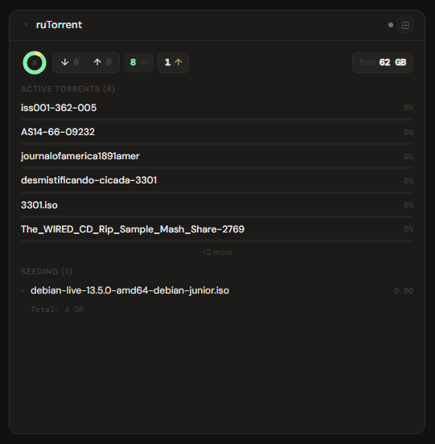
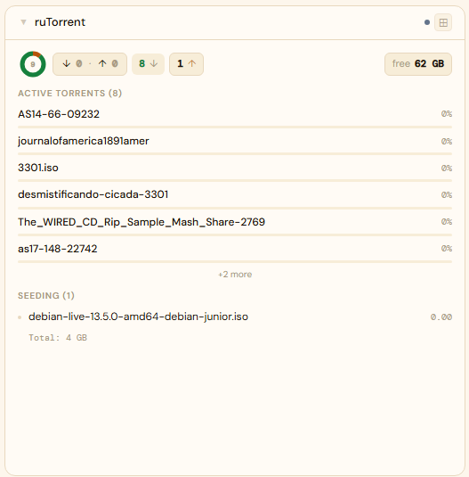

# ruTorrent

**Category:** Downloads | **Status:** ✅ Tested | **Polling:** 30 s

---

## Integration

**Secret format:** `username:password` or blank

> Your ruTorrent HTTP Basic Auth credentials. Leave blank if ruTorrent has no authentication configured (not recommended for network-accessible instances).
>
> ruTorrent does not have its own API key system — it relies on the web server's HTTP Basic Auth. The credential is set at the web server level (nginx, Apache, or the built-in lighttpd), not inside ruTorrent itself.

**URL required:** Required

**Example URL:** `http://192.168.1.10:8080`

### Setup

1. Admin → Secrets → New: paste `username:password` (or leave blank if no auth)
2. Admin → Integrations → New: type ruTorrent, URL = your ruTorrent web root (e.g. `http://rutorrent:8080`), select secret
3. Admin → Panels → New: type ruTorrent, assign to the integration

### How it works

Stoa calls ruTorrent's **httprpc plugin** at `/plugins/httprpc/action.php`. Two modes are used:

- `mode=list` — returns all torrents with state, speed, size, progress, and ratio in a single call
- `mode=trkl` — returns per-torrent tracker announce URLs (used for the tracker breakdown chart); silently skipped if the httprpc plugin version on your install doesn't support it

The httprpc plugin must be installed and enabled (it ships with ruTorrent by default). Authentication uses HTTP Basic Auth — the same credentials used to access the ruTorrent web UI.

Updates arrive via SSE push from Stoa's internal polling worker every 30 seconds. No WebSocket connection to ruTorrent is required.

---

## Panel

Torrent state donut, aggregate speeds, per-state counts, active torrent list, seeding list, and tracker breakdown.

### Height behavior

| Height | What you see |
|---|---|
| 1x | State donut + speed pill (↓/↑) + per-state count pills (downloading, seeding, paused, checking) + free space |
| 2–3x | 1x summary + **Active Torrents (N)** list — name, progress bar, speed, ETA or ratio — up to 6 items |
| 4x+ | 2x content + **Seeding (N)** list (amber dot if uploading, name, upload speed, color-coded ratio) + **By Tracker** bar chart |

**Ratio coloring:** green ≥ 1.0 · amber ≥ 0.5 · dim < 0.5

**By Tracker** only appears if your ruTorrent installation's httprpc plugin supports `mode=trkl`. If it doesn't, the section is silently omitted.

### Screenshots

| | Dark | Light |
|---|---|---|
| **1x** |  |  |
| **2x** |  |  |
| **4x** |  |  |
