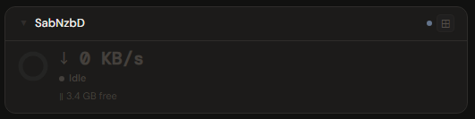
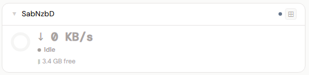
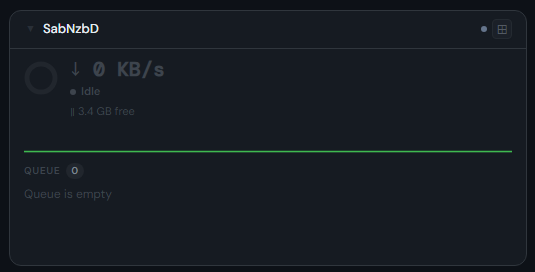
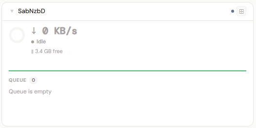
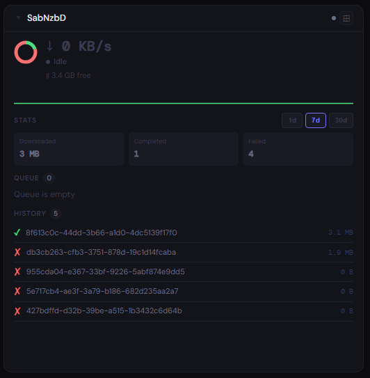
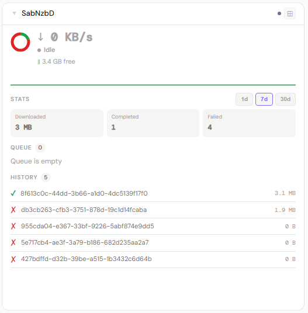

# SABnzbd

**Category:** Downloads | **Status:** ✅ Tested | **Polling:** Adaptive — 5 s during active downloads, configured interval when idle

---

## Integration

**Secret format:** Plain API key

> SABnzbd → Config → General → API Key. Copy the full key (typically 32 hex characters). Paste it alone — no username, no colon.

**URL required:** Required

**Example URL:** `http://192.168.1.10:8080`

### Setup

1. SABnzbd → Config → General → copy **API Key**
2. Admin → Secrets → New: paste the key
3. Admin → Integrations → New: type SABnzbd, URL = `http://sabnzbd:8080`, select secret
4. Admin → Panels → New: type SABnzbd, assign integration

### How it works

Stoa calls two SABnzbd REST endpoints per poll cycle:

- `GET /api?mode=queue&output=json&apikey=<key>` — current queue: speed, slots, status, time left, free disk on the complete folder (`diskspace2`)
- `GET /api?mode=history&output=json&apikey=<key>&limit=500` — last 500 history items used to compute 1d/7d/30d period stats; only the 10 most recent are sent to the panel for display

> **Note — SABnzbd serializes all numeric fields as JSON strings.** Fields like `kbpersec`, `mbleft`, `diskspace2`, `mb`, `mbleft` (per slot), and `percentage` arrive as `"12.34"` rather than `12.34`. The backend parser handles this transparently using `sabParsePct()`.

**Adaptive worker:** SABnzbd runs a dedicated SSE worker (not the generic interval poller). While any slot is actively downloading (`queueCount > 0` and not paused) it polls every **5 seconds** to drive the sparkline. After the queue drains it holds the 5 s rate for a **30 s coast-down**, then falls back to the configured refresh interval. A 60-entry MB/s ring buffer is maintained in the worker goroutine and injected as `speedHistory` into every cache update.

Updates arrive via SSE push — the frontend never polls; it reacts to pushes from the worker.

---

## Panel

Queue state donut, live speed with sparkline, 1d/7d/30d period stats, free disk, per-slot progress bars, and recent history.

### Height behavior

| Height | What you see |
|---|---|
| 1x | State donut + download speed + status dot + queue count/remaining/free disk |
| 2x | 1x summary + speed sparkline + **Queue** list — up to 6 slots with progress bars |
| 3x+ | 2x content + **Stats** (1d/7d/30d pill selector: downloaded GB, completed count, failed count) + queue + history at 4x+ |
| 4x+ | All of the above + **History** — up to 10 recent completed/failed items |

**Donut segments (when queue active):** green = downloading · accent = queued · amber = paused · red = failed

**Donut when queue is empty:** reflects the currently selected period — green = completed downloads, red = failures — so the donut stays informative between download sessions and honors the 1d/7d/30d pill selection.

**Free disk** shown is `diskspace2` — free space on the configured **complete folder** disk, not the temp/incomplete folder disk.

### Screenshots

| | Dark | Light |
|---|---|---|
| **1x** |  |  |
| **2x** |  |  |
| **4x** |  |  |
