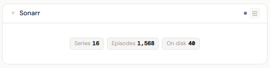
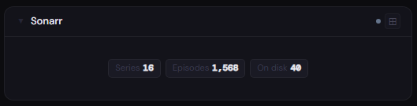
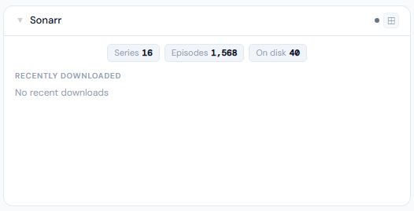
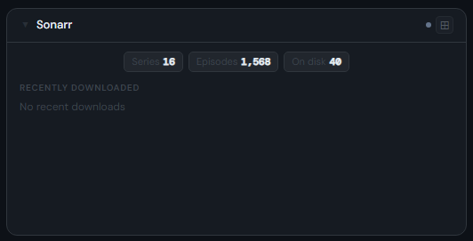
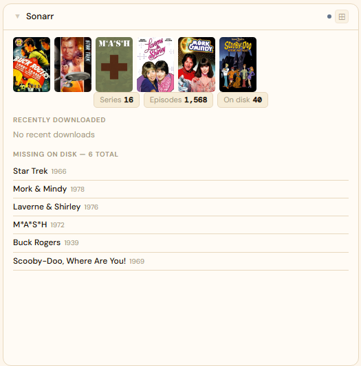
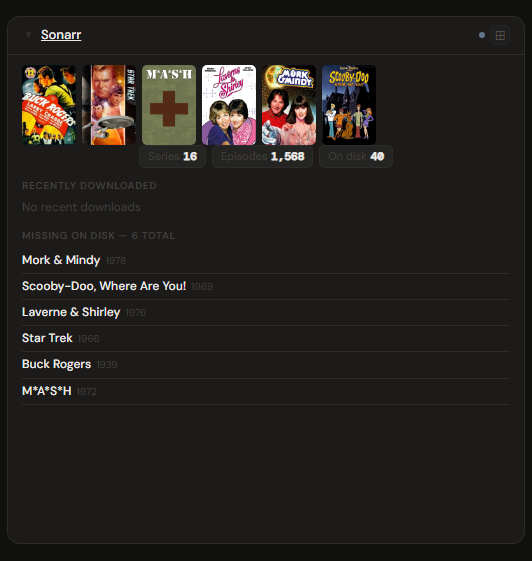

# Sonarr

**Category:** Media Management | **Status:** ✅ Tested | **Polling:** 30 min

---

## Integration

**Secret format:** Plain API key

> Sonarr → Settings → General → Security → API Key

**URL required:** Required — point at your Sonarr port

**Example URL:** `http://192.168.1.10:8989`

### Setup

1. Sonarr → Settings → General → copy the API Key
2. Admin → Secrets → New: paste the key
3. Admin → Integrations → New: type `Sonarr`, URL = `http://sonarr:8989`, select your secret
4. Admin → Panels → New: type `Sonarr`, select the integration

---

## Panel

Series library overview with upcoming episode schedule, recently downloaded episodes, missing-on-disk count with a sample list, and library stats (series / episodes / on disk).

### Height behavior

| Height | What you see |
|---|---|
| 1x | Stat chips: series count · episode count · on disk count |
| 2x | Stat chips + recently downloaded episodes (grouped by series) |
| 3x | + Missing on disk — random sample of series with no episode files |
| 4x+ | Poster artwork filmstrip + stat chips + recently downloaded + missing on disk |

### Artwork filmstrip (4x+)

The 4x filmstrip displays poster artwork for recently downloaded or upcoming episodes. If no downloads or upcoming air dates are available (e.g. a fresh setup or manual-import-only environment), the filmstrip falls back to artwork for series that have no episode files on disk — giving a visual "want list." Posters are fetched from Sonarr through Stoa's **image proxy** (`/api/images/proxy`), so your Sonarr instance does not need to be publicly accessible.

### Content rating filter

An optional `allowedRatings` config field accepts a comma-separated list of content ratings (e.g. `TV-G,TV-PG,TV-14`). When set, only series whose Sonarr rating matches the list appear in the filmstrip and missing-on-disk sections — useful for shared family dashboards.

### How data flows

On each 30-minute poll cycle the backend calls:

| Endpoint | Data retrieved |
|---|---|
| `GET /api/v3/calendar` | Upcoming episodes (90-day window) with series poster URLs |
| `GET /api/v3/history` | Recently grabbed/imported episodes with series poster URLs |
| `GET /api/v3/series` | Full library — series counts, episode file counts, poster URLs |

All data is stored in the backend cache keyed by integration ID. The browser never calls Sonarr directly, and poster artwork is served through Stoa's image proxy — Sonarr's internal URLs are never exposed to the browser.

The panel subscribes to **Server-Sent Events (SSE)**. When the worker refreshes the cache, it broadcasts a `cache-update` event on the integration's SSE channel. The panel updates automatically without a page reload.

### Screenshots

| | Light | Dark |
|---|---|---|
| **1x** |  |  |
| **2x** |  |  |
| **4x** |  |  |

---

## Notes

**Calendar:** Sonarr episode air dates appear on the Calendar panel. Add Sonarr as a calendar source in Profile → Calendar Sources.

**Missing-on-disk sample:** The 3x/4x missing list shows a random 8-series sample that re-shuffles on each data refresh, giving a rotating view of your wanted library without scrolling through everything.
