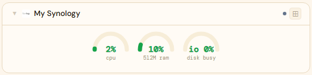
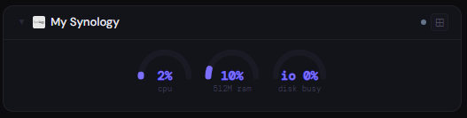
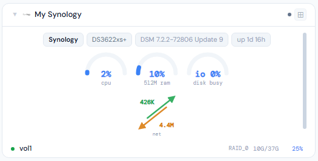
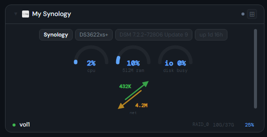
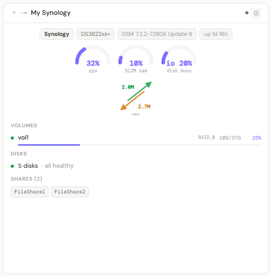
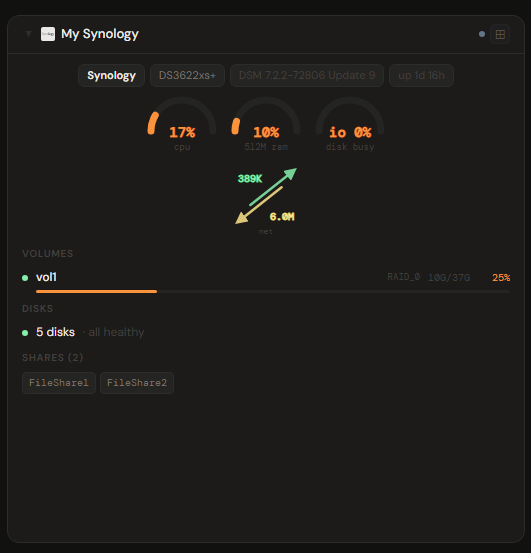

# Synology DSM

## What is Synology DSM?

Synology DiskStation Manager (DSM) is the operating system that runs on Synology NAS appliances. It manages storage volumes and RAID, serves files over SMB/NFS/AFP, and runs a large ecosystem of first-party apps (Photos, Drive, Surveillance Station, and more) through a polished web-based desktop.

**Official site:** [synology.com](https://www.synology.com)

---

## Getting the key

Use your Synology DSM login in `username:password` form (e.g. `admin:yourpassword`).

- **Secret format:** `username:password`
- **URL:** required — point at your DSM port, e.g. `http://192.168.1.10:5000`
- **Use an administrator account, not a limited one.** Storage Manager data (volumes, disks, shares) is read through DSM APIs (`SYNO.Core.Storage.*`) that a non-admin DSM user is typically not permitted to call at all — a limited account may log in fine and show CPU/RAM/network, while the storage sections stay silently empty. If you want a dedicated account rather than reusing your main admin login, put it in the `administrators` group.
- **Disable two-factor auth on the account Stoa uses.** Stoa authenticates with a plain username/password against the DSM API — there's nowhere for a 2FA code to go. DSM will refuse login with a "two-factor authentication required" error for any account that has it enabled.

---

## Add it to Stoa

1. **Admin → Secrets → New** — paste `admin:yourpassword` (use a dedicated account if possible).
2. **Admin → Integrations → New** — select **Synology**, enter the URL, choose the secret.
3. **Admin → Panels → New** — select **Synology**.

---

## Panel

CPU, memory, network, and disk I/O (read/write MB/s + busy%) arcs, refreshed on the integration's configured interval — DSM has no push/streaming API, so unlike Unraid/TrueNAS this is poll-only. Storage shows as a one-line disk-health summary ("N disks · all healthy" or naming the ones to check) rather than a per-disk table, plus a volume list (name, RAID type, filesystem, used/total). An **Alerts** section surfaces degraded volumes and any disk with a SMART/status issue — DSM has no single unified alerts feed of its own. Shows hostname, model, DSM version, and uptime.

### Height behavior

| Height | What you see |
|---|---|
| 1x | Compact arcs only |
| 2-3x | Arcs + volume rows + disk health summary |
| 4x+ | All of the above + per-interface network breakdown + Alerts detail |

### Screenshots

| | Light | Dark |
|---|---|---|
| **1x** |  |  |
| **2x** |  |  |
| **4x** |  |  |

---

## Notes

- Degraded volumes show an amber warning badge in the panel header at any height.
- **No live push.** DSM's `webapi` is session-cookie REST only — no SSE/WebSocket equivalent to Unraid's GraphQL subscriptions or TrueNAS's own WebSocket API. Everything here, including CPU/RAM, is polled on the integration's configured refresh interval.
- **Disk I/O (read/write MB/s, busy%) comes from a previously-unparsed part of an endpoint Stoa already called** (`SYNO.Core.System.Utilization.get`'s `disk` block). The byte-rate fields are named `read_byte`/`write_byte` — DSM's docs don't state the unit outright, and unlike the network fields (documented KB/s) these aren't confirmed against a real sustained transfer yet. Treated as bytes/sec here; flag it if the read/write numbers look off by 1000x against a known transfer.
- **No CPU temperature is exposed anywhere in DSM's utilization API** — confirmed by inspecting the full raw response, not just a missing field guess. Unlike Unraid/TrueNAS, there's no sensor data to surface here.
