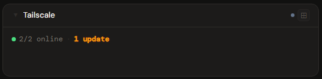
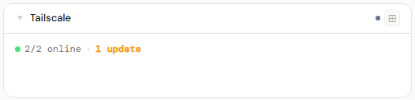
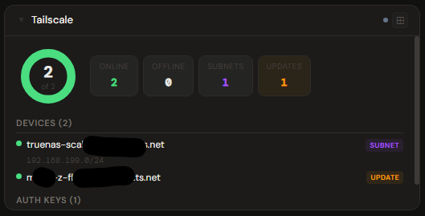
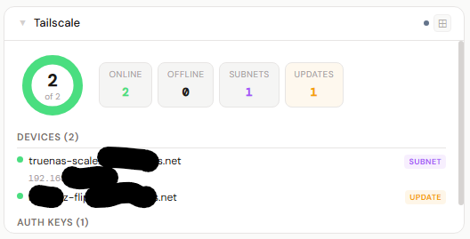
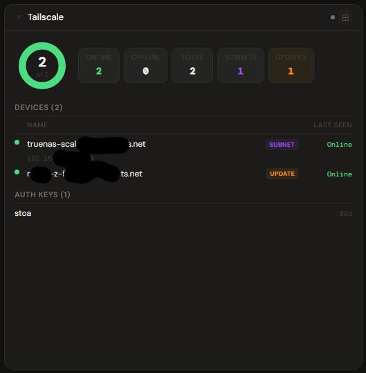
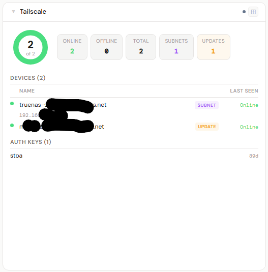

# Tailscale

**Category:** VPN & Security | **Status:** Tested | **Polling:** 60 s

---

## Integration

**Secret format:** API token (`tskey-api-...`)

> Tailscale admin console → Settings → Keys → Generate access token. The token starts with `tskey-api-`.

**URL required:** None — leave blank unless you have a named tailnet.

> **URL field (optional):** Leave blank to use your default tailnet. If you have a named tailnet (e.g. `yourorg.github`), enter just the tailnet name in the URL field — not a full URL.

### Setup

1. Tailscale admin console → Settings → Keys → **Generate access token** (`tskey-api-...`)
2. Stoa → **Admin → Secrets → New**: paste the token
3. Stoa → **Admin → Integrations → New** → select **Tailscale**, leave URL blank, select the secret → **Save**
4. Stoa → **Admin → Panels → New** → select **Tailscale**, select the integration → **Create**

---

## Panel

Mesh VPN device roster — online/offline status, advertised routes, role (exit node, subnet router), update availability, and key expiry warnings. Also surfaces your Tailscale auth keys with expiry countdowns so you know when to rotate them.

### Height behavior

| Height | What you see |
|---|---|
| 1x | Online/total count · update and unauthorized alerts · key expiry warnings |
| 2–3x | Online/total donut + stat chips + device list with routes + auth keys section |
| 4x+ | Donut + full stat chips + device table with routes + auth keys section |

### Screenshots

| | Dark | Light |
|---|---|---|
| **1x** |  |  |
| **2x** |  |  |
| **4x** |  |  |

---

## Notes

- Stoa calls `api.tailscale.com` directly — no self-hosted Tailscale infrastructure needed
- Online/offline status is derived from `connectedToControl` — a device is online when it has an active connection to the Tailscale control plane
- Advertised routes show under each device in dim monospace; routes advertised but not yet approved in the admin console appear in yellow as `(pending)`
- Exit node routes (`0.0.0.0/0`) are shown as the **EXIT** badge rather than in the routes line to avoid redundancy
- **Auth keys section:** shows all active (non-revoked) auth keys and API tokens with their expiry countdown. Color goes dim → orange at 30 days → red at 7 days. Useful for tracking the 90-day expiry on your subnet router enrollment key and your API access token
- The API token used by Stoa itself (`tskey-api-...`) appears in the auth keys list alongside device enrollment keys
