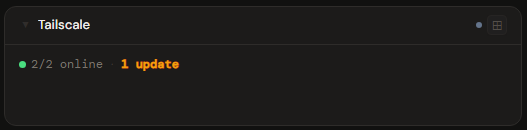
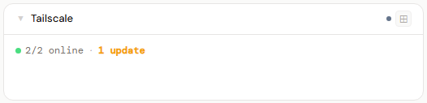
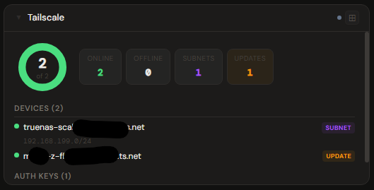
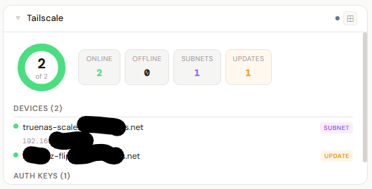
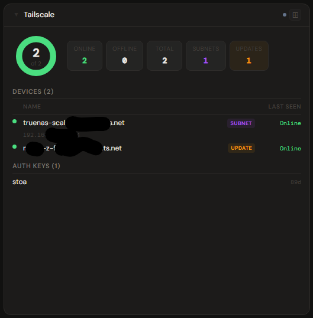
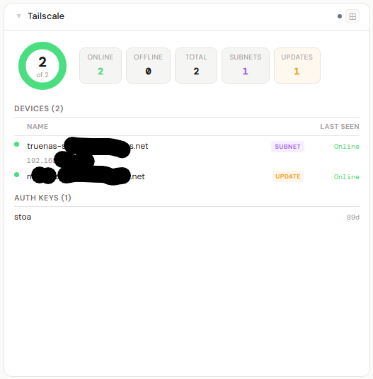

# Tailscale

## What is Tailscale?

Tailscale is a mesh VPN built on WireGuard that connects your devices into a private network (a "tailnet") with almost no configuration. Devices authenticate through your identity provider and reach each other directly wherever they are, with features like subnet routers, exit nodes, and MagicDNS.

**Official site:** [tailscale.com](https://tailscale.com)

---

## Getting the key

Tailscale admin console → **Settings → Keys → Generate access token**. The token starts with `tskey-api-`.

- **Secret format:** API token (`tskey-api-...`)
- **URL:** none — leave blank to use your default tailnet. If you have a named tailnet (e.g. `yourorg.github`), enter just the tailnet name (not a full URL).

---

## Add it to Stoa

1. **Admin → Secrets → New** — paste the token.
2. **Admin → Integrations → New** — select **Tailscale**, leave URL blank, choose the secret → **Save**.
3. **Admin → Panels → New** — select **Tailscale**.

---

## Panel

Mesh VPN device roster — online/offline status, advertised routes, role (exit node, subnet router), update availability, and key expiry warnings. Also surfaces your Tailscale auth keys with expiry countdowns so you know when to rotate them.

### Height behavior

| Height | What you see |
|---|---|
| 1x | Online/total count · update and unauthorized alerts · key expiry warnings |
| 2–3x | Online/total donut + stat chips + device list with routes + auth keys section |
| 4x+ | Donut + full stat chips + device list grouped by owning user (each group header shows online/total for that user) with routes + auth keys section |

### Screenshots

| | Dark | Light |
|---|---|---|
| **1x** |  |  |
| **2x** |  |  |
| **4x** |  |  |

---

## Notes

- Stoa calls `api.tailscale.com` directly — no self-hosted Tailscale infrastructure needed
- Online/offline status is derived from `connectedToControl` — a device is online when it has an active connection to the Tailscale control plane
- At 4x+, devices are grouped by owning user — one person commonly owns several endpoints (phone, laptop, exit node), so the flat table is broken into per-user sections instead. Devices with no owning user (e.g. tagged infrastructure devices) fall into a "Tagged devices" group
- Advertised routes show under each device in dim monospace; routes advertised but not yet approved in the admin console appear in yellow as `(pending)`
- Exit node routes (`0.0.0.0/0`) are shown as the **EXIT** badge rather than in the routes line to avoid redundancy
- **Auth keys section:** shows all active (non-revoked) auth keys and API tokens with their expiry countdown. Color goes dim → orange at 30 days → red at 7 days. Useful for tracking the 90-day expiry on your subnet router enrollment key and your API access token
- The API token used by Stoa itself (`tskey-api-...`) appears in the auth keys list alongside device enrollment keys
