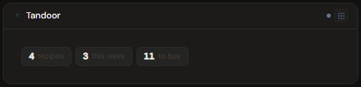
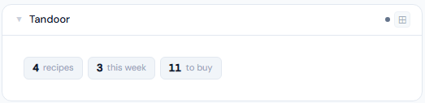
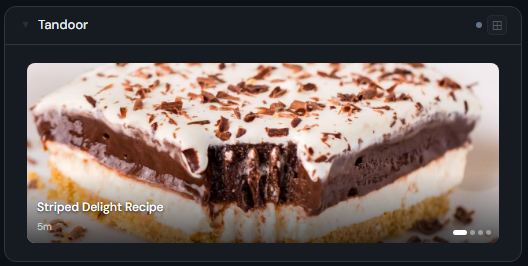
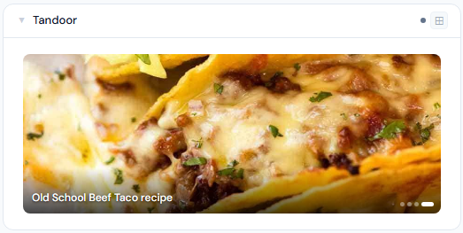
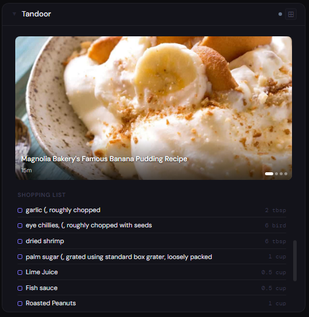
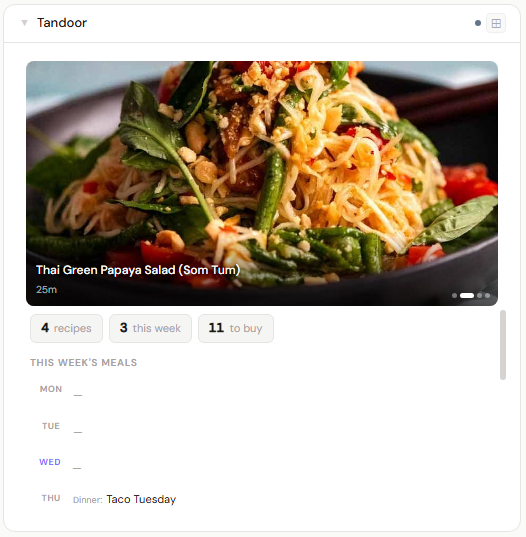

# Tandoor

**Category:** Food & Home | **Status:** Tested | **Polling:** 15 min

---

## Integration

**Secret format:** API token (Bearer)

> Tandoor → **Settings → API Tokens** → create a token with read access → copy it

**URL required:** Yes — base URL of your Tandoor instance

**Example URL:** `http://192.168.1.10:8080`

### Setup

1. In Tandoor, go to **Settings → API Tokens** → create a new token (read scope is sufficient) → copy it
2. Stoa → **Admin → Secrets → New**: paste the token (no prefix — Stoa adds `Bearer` automatically)
3. Stoa → **Admin → Integrations → New**: type **Tandoor**, enter your Tandoor URL, select the secret
4. Stoa → **Admin → Panels → New**: type **Tandoor**, select the integration

> The API token is required. If you see a 403 error, check that the token was copied correctly — Tandoor's "Copy" button can silently fail; paste into a text editor first to verify.

---

## Panel

Recipe and meal planning panel — full-panel photo carousel of random recipes, weekly 7-day meal plan, and shopping list. Photos auto-advance every 4 seconds and pause on hover.

### Height behavior

| Height | What you see |
|---|---|
| 1x | Stat chips: recipe count · meals this week · shopping items |
| 2–3x | Full-panel recipe photo carousel with recipe name overlay |
| 4x+ | Photo carousel (top) + stat chips + 7-day meal plan + shopping list (scrollable) |

### Photo carousel

- Shows up to 6 randomly selected recipes each poll cycle — refreshes every 15 minutes so the panel looks different throughout the day
- Recipes without photos are excluded from the carousel
- Click any photo to open the recipe in Tandoor
- Dot navigation at bottom-right; hover to pause auto-advance

### Meal plan

- Displays all 7 days of the current week (Mon–Sun)
- Today's row is highlighted in accent color
- Entries link to the Tandoor meal plan page

### Screenshots

| | Dark | Light |
|---|---|---|
| **1x** |  |  |
| **2x** |  |  |
| **4x** |  |  |

---

## Notes

- Recipe images are proxied through Stoa (auth-gated) — they will not load if the backend cannot reach your Tandoor instance
- The meal plan uses Tandoor's `from_date` datetime field; times are stripped to date-only for display
- Shopping list shows unchecked entries from Tandoor's shopping list
