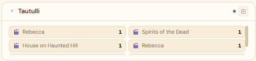
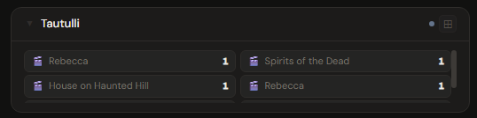
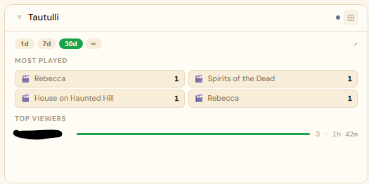
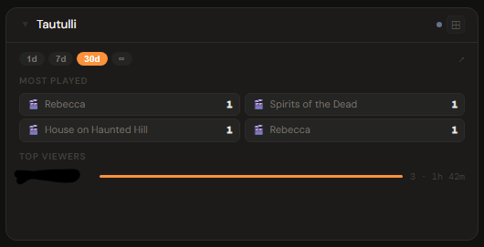
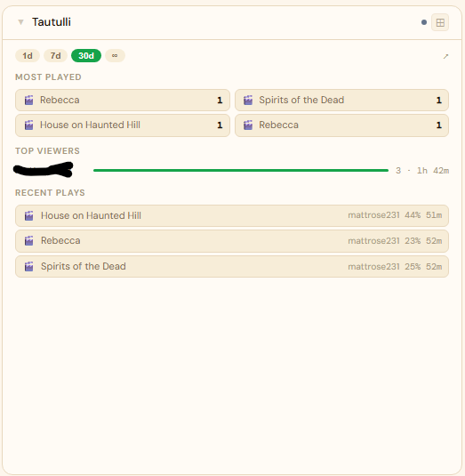
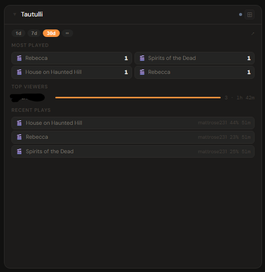

# Tautulli

**Category:** Media Servers | **Status:** ✅ Tested | **Polling:** 60 s

---

## Integration

**Secret format:** Plain API key

> Tautulli → Settings → Web Interface → scroll to API section → copy the API Key.

**URL required:** Required — point at your Tautulli port

**Example URL:** `http://192.168.1.10:8181`

### Setup

1. Tautulli → Settings → Web Interface → copy the API Key
2. Admin → Secrets → New: paste the key
3. Admin → Integrations → New: type `Tautulli`, URL = `http://tautulli:8181`, select your secret
4. Admin → Panels → New: type `Tautulli`, select the integration

---

## Panel

**Analytics panel** — shows historical play statistics, top viewers, most played content, and recent play history for the selected time range. This is not a now-playing panel; for live stream monitoring use the Plex panel directly.

### Height behavior

| Height | What you see |
|---|---|
| 1x | Stat tiles: total plays · hours watched · unique users · time range label |
| 2–3x | Time range picker · summary chips (plays / hours / users) · top viewers with bar chart |
| 4x+ | + Most played content section · recent play history list |

### Time range selection

The `[1d] [7d] [30d] [∞]` pill picker controls the reporting window. Selecting a pill re-fetches data for that period. The `∞` option returns all-time data from Tautulli's full configured history. The selected range is persisted to the panel config and restored on reload.

### How data flows

On each 60-second poll cycle the backend calls Tautulli's `get_home_stats` and `get_users_table` API commands for the configured time range. Play totals, duration, unique user count, top users, most played items, and recent history are all derived from these responses and cached by integration ID.

The panel subscribes to **Server-Sent Events (SSE)**. When the worker refreshes the cache, it broadcasts a `cache-update` event on the integration's SSE channel. The panel receives this signal and re-fetches with the current time range selection — keeping the display current without any user action.

### Screenshots

| | Light | Dark |
|---|---|---|
| **1x** |  |  |
| **2x** |  |  |
| **4x** |  |  |

---

## Notes

- Tautulli must be connected to a running Plex Media Server — it only records play history for sessions it has observed.
- The `∞` time range queries Tautulli's full history retention. If retention is configured shorter than 30 days, the 30d option will return incomplete data.
