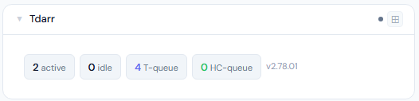
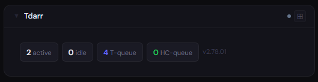
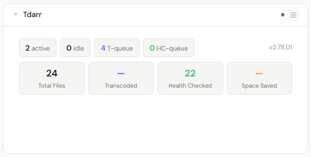
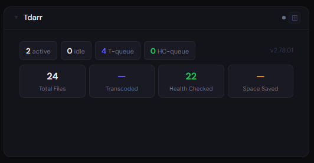
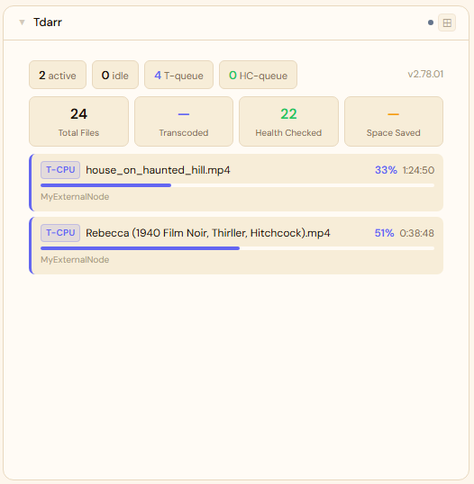
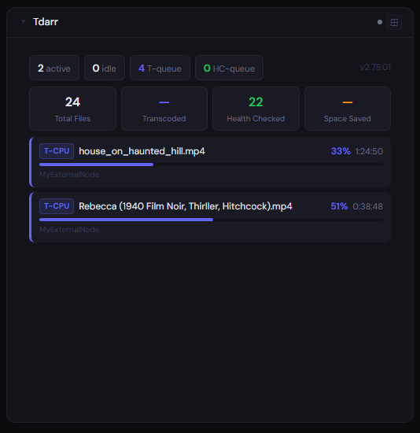

# Tdarr

**Category:** Media Management | **Status:** Tested | **Polling:** 30 s

---

## Integration

**Secret format:** Blank (no auth) **or** plain API key **or** `username:password` (reverse-proxy)

> Tdarr → Tools → API Keys to create a key. Leave the secret blank if your instance has no authentication.

**URL required:** Required

**Example URL:** `http://192.168.1.10:8265`

### Setup

1. If using auth: Tdarr → Tools → API Keys → create a key
2. Stoa → Admin → Secrets → New: paste key, or leave blank
3. Stoa → Admin → Integrations → New: select **Tdarr**, enter URL and secret
4. Stoa → Admin → Panels → New: select **Tdarr**

---

## What is Tdarr?

Tdarr is a self-hosted media transcoding automation system. It scans your media libraries, runs files through configurable plugin stacks or flows (e.g. convert to H.265, remove unwanted streams, health-check containers), and manages a distributed worker pool across multiple nodes. Workers can run on the same machine as the server or on remote nodes.

---

## Panel

Real-time worker status — active transcodes with filename, progress, and ETA — plus queue depth and lifetime library stats.

### What's shown

- **Status tiles** (all sizes) — active workers · idle workers · transcode queue depth · health-check queue depth; version shown at the right
- **Lifetime stat chips** (2x+) — Total Files · Transcoded · Health Checked · Space Saved
- **Worker cards** (4x) — one card per active worker showing: worker type badge (T-CPU / T-GPU / HC-CPU / HC-GPU), filename currently being processed, progress bar, percentage, ETA, and node name

### Height behavior

| Height | What you see |
|---|---|
| 1x | Status tiles — active · idle · T-queue · HC-queue |
| 2–3x | Status tiles + lifetime stat chips (Total · Transcoded · Health Checked · Space Saved) |
| 4x+ | Status tiles + stat chips + active worker cards with filename, progress, and ETA |

Each size adds a section beneath the previous — the status tiles are always visible at the top.

### Screenshots

| | Light | Dark |
|---|---|---|
| **1x** |  |  |
| **2x** |  |  |
| **4x** |  |  |

---

## Notes

- **Polling and SSE:** Stoa polls Tdarr every 30 seconds. Results are cached and pushed to all connected browsers via SSE — no manual refresh needed
- **API calls per poll:** `/api/v2/status` (version), `/api/v2/get-nodes` (workers + queue lengths), `/api/v2/cruddb` (lifetime stats)
- **Queue counts** come from `queueLengths` on each node in the get-nodes response — they reflect files currently assigned to each node's queue, not global totals. If you have multiple nodes, counts are summed
- **Filenames** are the basename of the source file path as reported by the worker's active job. They appear only when a worker is actively processing — idle workers show nothing in the 4x worker list
- **Lifetime stats** (Total Files, Transcoded, Health Checked, Space Saved) come from Tdarr's `StatisticsJSONDB` and reflect all-time activity across all libraries
- **Space Saved** is the cumulative `sizeDiff` from the statistics — the difference between original and output file sizes across all transcodes ever completed
- **Authentication:** Tdarr supports no auth, a plain API key (`x-api-key` header), or Basic auth for reverse-proxied instances. Stoa detects the colon pattern — `username:password` sends Basic auth, anything else is treated as an API key
- **API endpoints used:** `/api/v2/status`, `/api/v2/get-nodes`, `/api/v2/cruddb` (StatisticsJSONDB)
