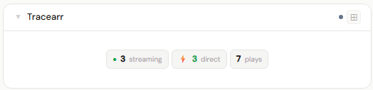
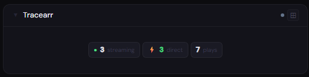
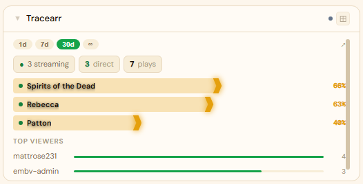
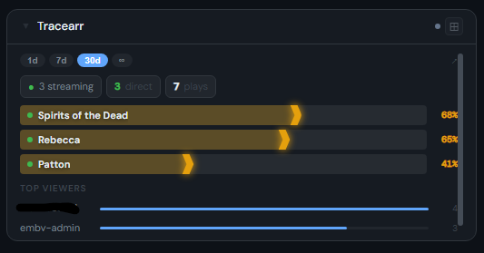
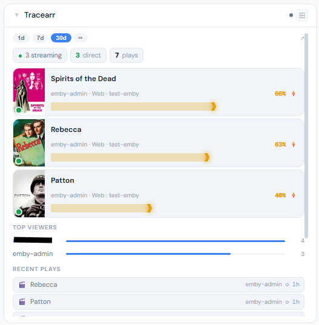
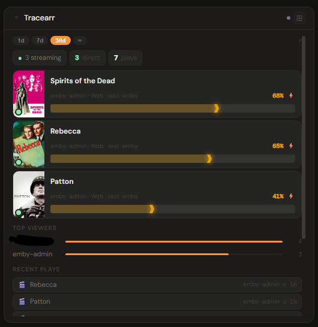

# Tracearr

**Category:** Media Servers | **Status:** ✅ Tested | **Polling:** 60 s

---

## Integration

**Secret format:** Plain API key

> Tracearr → Settings → API → copy the API Key.

**URL required:** Required — point at your Tracearr port

**Example URL:** `http://192.168.1.10:8000`

### Setup

1. Tracearr → Settings → API → copy the API Key
2. Admin → Secrets → New: paste the key
3. Admin → Integrations → New: type `Tracearr`, URL = `http://tracearr:8000`, select your secret
4. Admin → Panels → New: type `Tracearr`, select the integration

---

## Panel

**Analytics panel** — shows aggregate play statistics, top users, recent play history, and unacknowledged account-sharing violations. Works across Plex, Jellyfin, and Emby simultaneously (Tracearr aggregates all three). For live now-playing, use the respective media server panel.

A live streaming indicator dot appears in the 1x view whenever at least one session is active.

### Height behavior

| Height | What you see |
|---|---|
| 1x | Stat tiles: streaming dot (if active) · total plays · hours watched · unique users · time range label |
| 2–3x | Time range picker · summary chips (plays / hours / users) · top users with bar chart |
| 4x+ | + Recent play history list · sharing violations section |

### Time range selection

The `[1d] [7d] [30d] [∞]` pill picker controls the reporting window. Selecting a pill re-fetches data for that period. The `∞` option returns data across Tracearr's full configured history. The selected range is persisted to the panel config and restored on reload.

### How data flows

On each 60-second poll cycle the backend queries Tracearr's history and summary APIs for the configured time range. Play totals, total duration, unique users, top users, and recent history are derived from the history records. Live session count is fetched from Tracearr's sessions endpoint separately.

The panel subscribes to **Server-Sent Events (SSE)**. When the worker refreshes the cache, it broadcasts a `cache-update` event on the integration's SSE channel. The panel receives this signal and re-fetches with the current time range — keeping the display current without any user action.

### Screenshots

| | Light | Dark |
|---|---|---|
| **1x** |  |  |
| **2x** |  |  |
| **4x** |  |  |

---

## Notes

- Tracearr must be connected to at least one media server (Plex, Jellyfin, or Emby) and have had time to record play history.
- Violations in the 4x view are unacknowledged account-sharing alerts from Tracearr's detection engine. Acknowledging them in Tracearr removes them from this view on the next poll.
