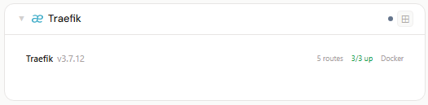
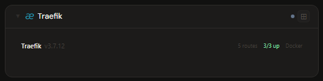
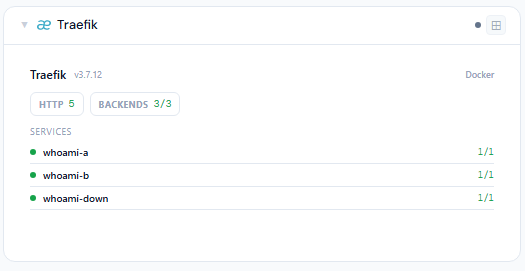
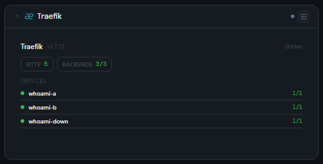
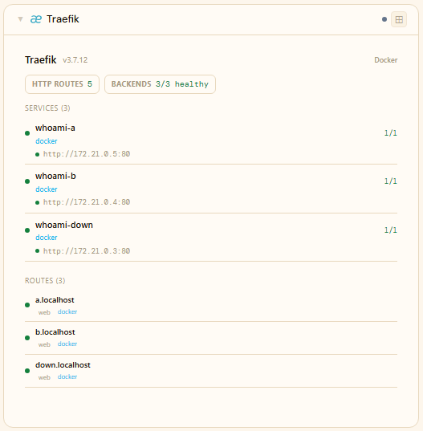
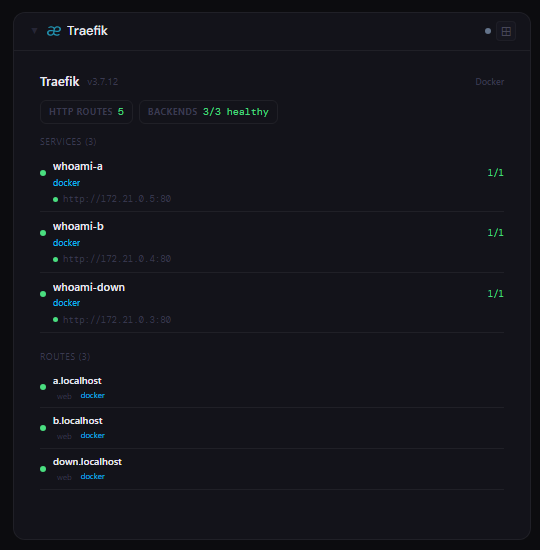

# Traefik

## What is Traefik?

Traefik is a modern, cloud-native reverse proxy and load balancer. It automatically discovers your services (Docker, Kubernetes, and more) and routes incoming traffic to them, handling TLS certificates, middleware, and load balancing with minimal manual configuration — a popular front end for containerized homelab services.

**Official site:** [traefik.io](https://traefik.io)

---

## Getting the key

Most homelab Traefik dashboards run open (no auth) — leave the secret blank. If you've added Basic Auth or a Bearer token, use that. The Traefik API must be enabled (`--api=true`).

- **Secret format:** blank (open), `username:password` (Basic Auth), or a bare Bearer token
- **URL:** required — point at your Traefik dashboard/API, e.g. `http://192.168.1.10:8080`

---

## Add it to Stoa

1. **Admin → Secrets → New** — leave blank, or paste your Basic Auth / Bearer credential.
2. **Admin → Integrations → New** — select **Traefik**, enter the URL, choose the secret (or none).
3. **Admin → Panels → New** — select **Traefik**.

---

## Panel

HTTP/TCP route inventory with enabled/warning/disabled status, backend service health (servers UP/DOWN), TLS indicators, entry point labels, and provider badges.

### Height behavior

| Height | What you see |
|---|---|
| 1x | Route count + backend health + active providers |
| 2-3x | Section chips + degraded backends + service list |
| 4x+ | Service list + route table, stacked vertically |

### Screenshots

| | Light | Dark |
|---|---|---|
| **1x** |  |  |
| **2x** |  |  |
| **4x** |  |  |

---

## Notes

Backend health requires Traefik health checks to be enabled for your services.
