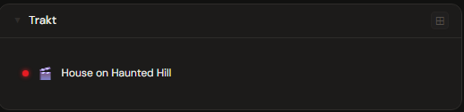
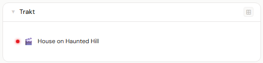
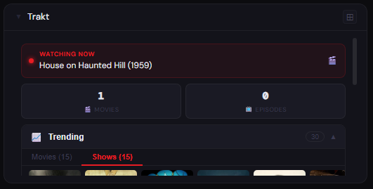
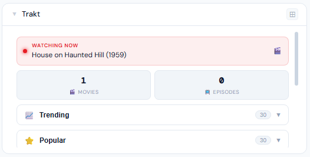
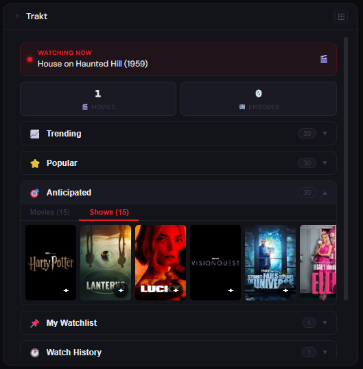
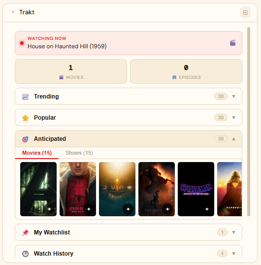

# Trakt

**Category:** Content | **Status:** Tested | **Polling:** 60 s

---

## Integration

**Secret format:** `clientId:username` or `clientId:username:tmdbApiKey`

- **clientId** — Client ID from your Trakt API app at `trakt.tv/oauth/applications`
- **username** — your Trakt username (visible at `trakt.tv/users/USERNAME`)
- **tmdbApiKey** *(optional)* — TMDB API key or v4 Read Access Token for poster artwork. Supports both v3 hex keys (`?api_key=`) and v4 JWT Bearer tokens (`eyJ…`). Get one at `themoviedb.org/settings/api`.

**URL required:** None — always uses `api.trakt.tv`

> Your Trakt profile must be set to **Public** (Account → Privacy → Public profile).

### Setup

1. Go to `trakt.tv/oauth/applications` → **New Application** → copy the **Client ID**
2. Admin → Secrets → New: value = `clientId:yourUsername` or `clientId:yourUsername:tmdbApiKey`
3. Admin → Integrations → New: type **Trakt**, no URL, select the secret
4. Admin → Panels → New: type **Trakt**, select the integration

---

## Panel

Trakt watch-tracking panel with live now-playing indicator, all-time stats, and collapsible artwork carousels for Trending, Popular, Anticipated, Watchlist, and Watch History. Artwork is fetched from TMDB (requires TMDB key in secret).

### Features

- **Now watching badge** — pulsing red dot with title when actively scrobbling via PlexTraktSync or similar
- **Stats bar** — total movies watched, episodes watched, and ratings count
- **Artwork carousels** — hover the left/right 15% edge to auto-scroll filmstrips; click any poster to open on trakt.tv
- **Add to Radarr / Sonarr** — ➕ button on each poster card; configure integrations via the ⚙ Add to ARR section in the panel
- **Accordion sections** — one open at a time; auto-opens the first section with data:
  - 📈 Trending (movies + shows tabs)
  - ⭐ Popular (movies + shows tabs)
  - 🎯 Anticipated (movies + shows tabs)
  - 📌 My Watchlist (movies + shows tabs)
  - 🕐 Watch History (deduped by show)
  - 📋 My Lists (links to your public custom lists)
  - ⚙ Add to ARR (Radarr + Sonarr integration selector)

### Height behavior

| Height | What you see |
|---|---|
| 1x | Live watching indicator or last watched title |
| 2x+ | Full panel — stats, all accordion sections, artwork carousels |

### Adding to Radarr / Sonarr

1. Expand **⚙ Add to ARR** at the bottom of the panel
2. Select your Radarr integration (for movies) and/or Sonarr integration (for shows)
3. Click **Save** — the ➕ button will now appear on every poster card
4. Click ➕ on any poster to add it (uses your first quality profile and root folder)

> Radarr uses the TMDB ID; Sonarr uses the TVDB ID — both are provided by Trakt on every item so no lookup is needed.

### Screenshots

| | Dark | Light |
|---|---|---|
| **1x** |  |  |
| **2x** |  |  |
| **4x** |  |  |

---

## Notes

- No OAuth flow required — Trakt exposes public watch data via Client ID + username only
- Poster artwork requires a TMDB API key (v3 or v4) in the secret; without it carousels show "No artwork available"
- **My Lists** only shows lists created via the classic Trakt site (`trakt.tv`). Lists created in the new Trakt app (`app.trakt.tv`) are not exposed by the public API — this is a Trakt platform limitation
- For live scrobbling, set up [PlexTraktSync](https://github.com/Taxel/PlexTraktSync) in Docker; use `command: watch` to keep it running persistently
