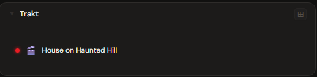
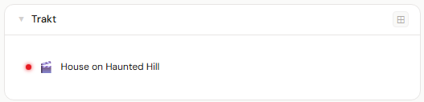
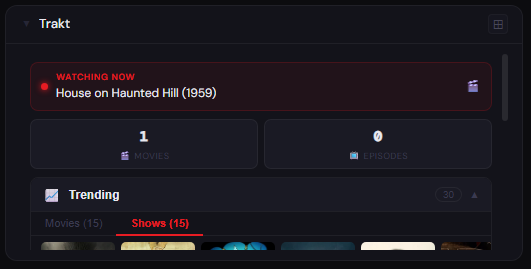
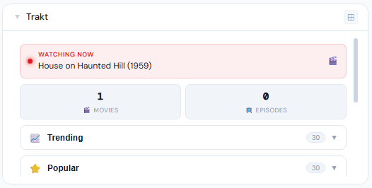
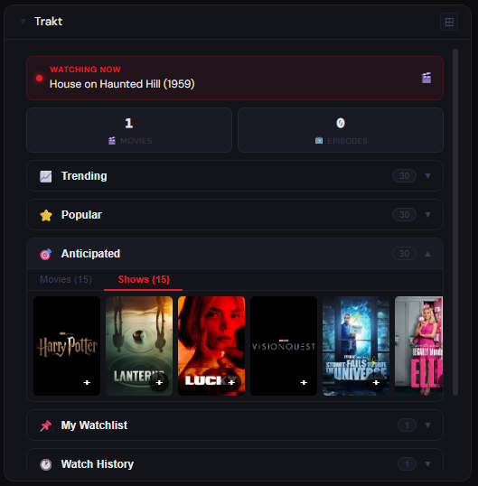
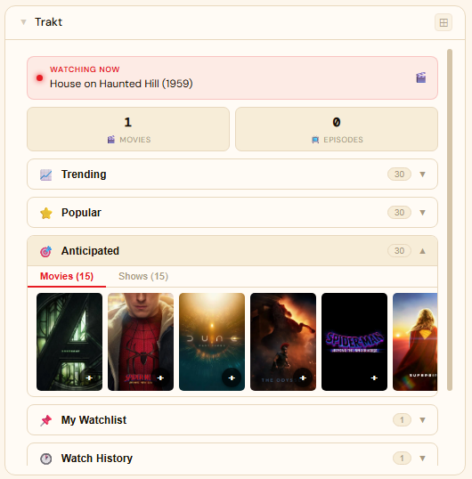

# Trakt (legacy)

> **Trakt abandoned its free tier, and Stoa is abandoning this integration in turn.** Sometime in mid-2026,
> Trakt ended free API-application access — existing free apps were deactivated and creating a new one now
> requires a paid VIP subscription, with no official announcement of the change (confirmed directly: existing
> apps deleted, the "create app" page now reads "Creating new apps requires Trakt VIP"). This integration
> still works if you already hold a paid Trakt app, but it will not receive further development. See the
> [TMDB integration](../tmdb/README.md) for the discovery + add-to-Radarr/Sonarr replacement, sourced
> directly from the same underlying metadata provider Trakt itself used, without the third-party
> monetization risk. TMDB can't replicate the personal watch-history/stats half of this panel — TMDB has no
> concept of what you've watched — but that wasn't the part that broke.

## What is Trakt?

Trakt is a service that automatically tracks the movies and TV shows you watch (scrobbling from Plex, Kodi, and others), with watchlists, ratings, and discovery lists. Stoa reads your public data to show watch history, stats, and Trending/Popular carousels — and can add titles straight to Radarr/Sonarr.

**Official site:** [trakt.tv](https://trakt.tv)

---

## Getting the key

Create an API app at [app.trakt.tv/settings/apps/api](https://app.trakt.tv/settings/apps/api) → click **+** → copy the **Client ID**. As of 2026 this requires a Trakt VIP subscription (see the notice above). Combine with your Trakt username (and optionally a TMDB key for artwork). Your Trakt profile must be **Public** (Account → Privacy).

- **clientId** — from your Trakt API app
- **username** — your Trakt username (at `trakt.tv/users/USERNAME`)
- **tmdbApiKey** *(optional)* — TMDB v3 hex key or v4 Read Access Token for poster artwork (from `themoviedb.org/settings/api`)
- **Secret format:** `clientId:username` or `clientId:username:tmdbApiKey`
- **URL:** none — always uses `api.trakt.tv`. No OAuth flow needed (public data via Client ID + username).

---

## Add it to Stoa

1. **Admin → Secrets → New** — value = `clientId:yourUsername` (or `clientId:yourUsername:tmdbApiKey`).
2. **Admin → Integrations → New** — select **Trakt**, no URL, choose the secret.
3. **Admin → Panels → New** — select **Trakt**.

---

## Panel

Trakt watch-tracking panel with live now-playing indicator, all-time stats, and collapsible artwork carousels for Trending, Popular, Anticipated, Watchlist, and Watch History. Artwork is fetched from TMDB (requires TMDB key in secret).

### Features

- **Now watching badge** — pulsing red dot with title when actively scrobbling via PlexTraktSync or similar
- **Stats bar** — total movies watched, episodes watched, and ratings count
- **Artwork carousels** — hover the left/right 15% edge to auto-scroll filmstrips; click any poster to open on trakt.tv
- **Add to Radarr / Sonarr** — ➕ button on each poster card; configure Radarr/Sonarr integrations and rating filters in Settings → Panels → Edit
- **Accordion sections** — one open at a time; auto-opens the first section with data:
  - 📈 Trending (movies + shows tabs)
  - ⭐ Popular (movies + shows tabs)
  - 🎯 Anticipated (movies + shows tabs)
  - 📌 My Watchlist (movies + shows tabs)
  - 🕐 Watch History (deduped by show)
  - 📋 My Lists (links to your public custom lists)

### Height behavior

| Height | What you see |
|---|---|
| 1x | Live watching indicator or last watched title |
| 2x+ | Full panel — stats, all accordion sections, artwork carousels |

### Adding to Radarr / Sonarr

1. Go to **Settings → Panels → Edit** (the pencil icon on the Trakt panel)
2. Select your Radarr integration (for movies) and/or Sonarr integration (for shows)
3. Click **Save** — the ➕ button will now appear on every poster card in the panel
4. Click ➕ on any poster to add it (uses your first quality profile and root folder)

> Radarr uses the TMDB ID; Sonarr uses the TVDB ID — both are provided by Trakt on every item so no lookup is needed.

### Rating filters

To keep shared dashboards family-safe, configure allowed ratings in **Settings → Panels → Edit**:

- **Movie ratings** — comma-separated MPAA ratings, e.g. `G, PG, PG-13`. Leave blank to show all.
- **TV ratings** — comma-separated TV ratings, e.g. `TV-Y, TV-G, TV-PG, TV-14`. Leave blank to show all.

Any international rating system is supported — just enter the rating strings as they appear on Trakt. Unrated / NR content is excluded whenever a filter is active.

### Screenshots

| | Dark | Light |
|---|---|---|
| **1x** |  |  |
| **2x** |  |  |
| **4x** |  |  |

---

## Notes

- No OAuth flow required — Trakt exposes public watch data via Client ID + username only
- Poster artwork requires a TMDB API key (v3 or v4) in the secret; without it carousels show "No artwork available"
- **My Lists** only shows lists created via the classic Trakt site (`trakt.tv`). Lists created in the new Trakt app (`app.trakt.tv`) are not exposed by the public API — this is a Trakt platform limitation
- For live scrobbling, set up [PlexTraktSync](https://github.com/Taxel/PlexTraktSync) in Docker; use `command: watch` to keep it running persistently
