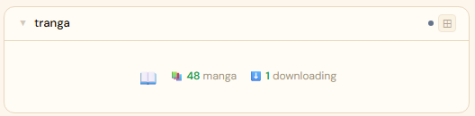
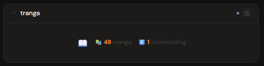
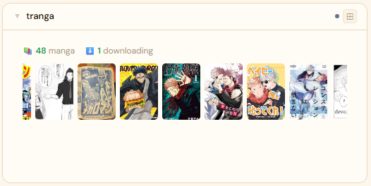
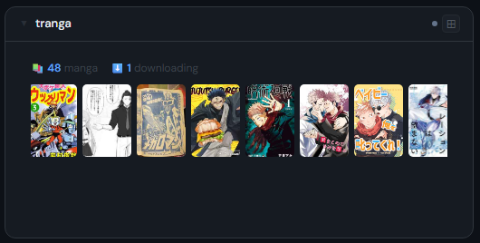
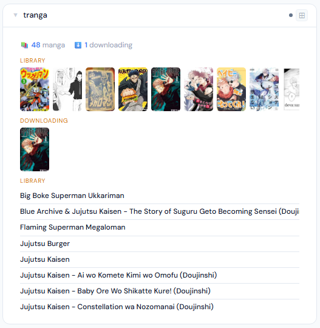
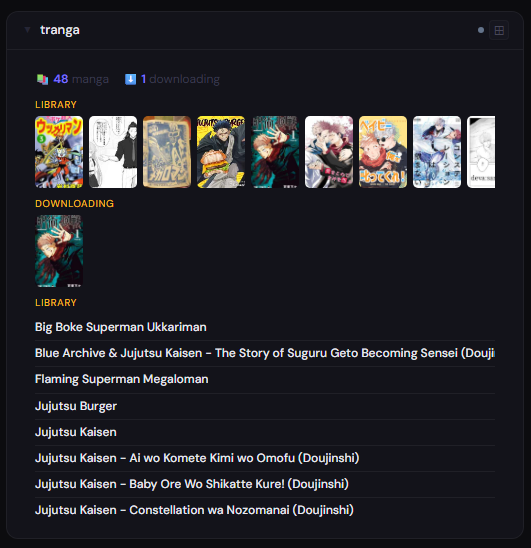

# Tranga

**Category:** Comics & Manga | **Status:** Tested | **Polling:** 30 min

---

## Integration

**Secret format:** Blank (no auth required by default)

> Tranga runs unauthenticated by default. Leave the API key field blank.

**URL required:** Required

**Example URL:** `http://tranga:9898`

### Setup

1. Stoa → Admin → Integrations → New: select **Tranga**, enter URL, leave API key blank
2. Stoa → Admin → Panels → New: select **Tranga**

> If you have configured an API key in Tranga (optional), paste it in the API key field.

---

## Panel

Manga downloader showing your library with publication status, active chapter downloads, and scrollable cover filmstrips for both library and currently downloading manga.

### What's shown

- **Stats** — manga count · active download count
- **Library filmstrip** (2x+) — scrollable cover strip of all manga in your library
- **Downloading filmstrip** (4x+) — cover strip of manga currently being downloaded; only shown when active downloads exist
- **Lists** (4x+) — library list with publication status (Ongoing / Completed / Hiatus / Cancelled) and active downloads column side by side

### Height behavior

| Height | What you see |
|---|---|
| 1x | Manga count · downloading count centered with panel icon |
| 2–3x | Stats + scrollable library cover filmstrip |
| 4x+ | Library filmstrip + downloading filmstrip (if active) + library list + downloading list |

### Screenshots

| | Light | Dark |
|---|---|---|
| **1x** |  |  |
| **2x** |  |  |
| **4x** |  |  |

---

## Notes

- **Auth:** Tranga has no authentication by default. If an API key is set, it is sent as the `X-API-Key` header
- **Manga IDs:** Tranga uses composite keys (e.g. `Manga-{hash}`) that may contain characters unsafe in URL paths. Cover requests use a query parameter (`?id=...`) with `url.PathEscape` so all ID formats are handled safely
- **Cover proxy:** Manga covers are fetched server-side by Stoa via `/v2/Manga/{id}/Cover/Small` and cached in the browser for 24 hours — the browser never contacts Tranga directly; only the Stoa server needs network access to it
- **Publication status colours:** Ongoing → green; Completed and unknown → dim; Hiatus and Cancelled → red
- **Polling and SSE:** Stoa polls Tranga every 30 minutes. Results are cached and pushed to all connected browsers via SSE — no manual refresh needed
- **API calls per poll:** `GET /v2/Manga` (full manga library with status), `GET /v2/Manga/Downloading` (actively downloading manga)
