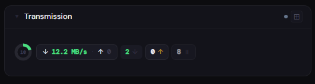
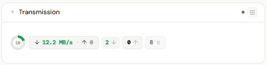
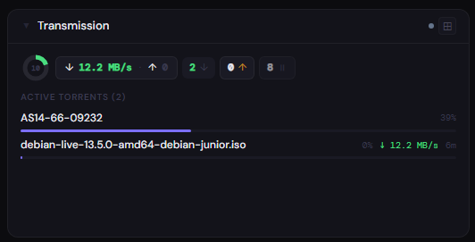
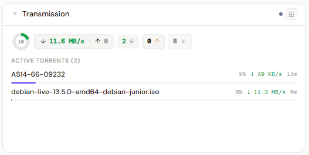
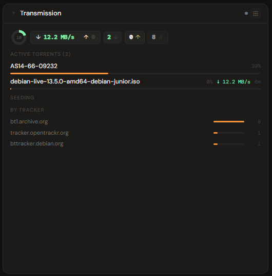
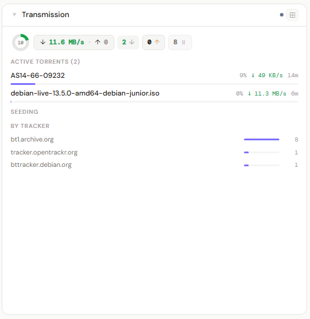

# Transmission

**Category:** Downloads | **Status:** ✅ Tested | **Polling:** 30 s

---

## Integration

**Secret format:** `username:password` or blank

> Your Transmission Web UI credentials. Leave blank if you have authentication disabled in Transmission's settings (`rpc-authentication-required: false`).

**URL required:** Required

**Example URL:** `http://192.168.1.10:9091`

### Setup

1. Admin → Secrets → New: paste `username:password` (or leave blank if auth is disabled)
2. Admin → Integrations → New: type Transmission, URL = `http://transmission:9091`, select secret
3. Admin → Panels → New: type Transmission, assign to the integration

### How it works

Stoa uses Transmission's **JSON-RPC API** at `/transmission/rpc`. Two calls are made per poll:

- `torrent-get` with fields `name`, `status`, `percentDone`, `totalSize`, `rateDownload`, `rateUpload`, `eta`, `trackers`, `downloadDir`, `uploadRatio` — returns all torrent data in one response
- `session-get` + `free-space` — fetches the download directory path then queries free disk space

Transmission's RPC uses the `X-Transmission-Session-Id` header for CSRF protection. Stoa handles the 409 handshake automatically — if the session ID expires or is missing, the response contains a new token which Stoa stores and retries with immediately.

Authentication uses HTTP Basic Auth sent with each RPC call. If you have auth disabled, leave the secret blank.

Updates arrive via SSE push every 30 seconds.

---

## Panel

Torrent state donut, aggregate speeds, per-state counts, active torrent list, seeding list, and tracker breakdown.

### Height behavior

| Height | What you see |
|---|---|
| 1x | State donut + speed pill (↓/↑) + per-state count pills (downloading, seeding, paused, checking) + free space |
| 2–3x | 1x summary + **Active Torrents (N)** list — name, progress bar, speed, ETA or ratio — up to 6 items |
| 4x+ | 2x content + **Seeding (N)** list (amber dot if uploading, name, upload speed, color-coded ratio) + **By Tracker** bar chart |

**Ratio coloring:** green ≥ 1.0 · amber ≥ 0.5 · dim < 0.5

Transmission status codes: 0=stopped, 1=check queued, 2=checking, 3=download queued, 4=downloading, 5=seed queued, 6=seeding. Statuses 0/1/3/5 count as paused.

### Screenshots

| | Dark | Light |
|---|---|---|
| **1x** |  |  |
| **2x** |  |  |
| **4x** |  |  |
