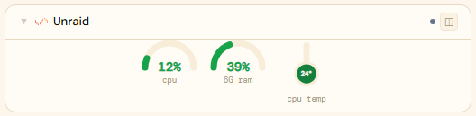
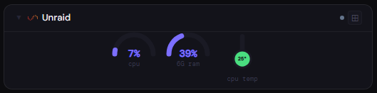
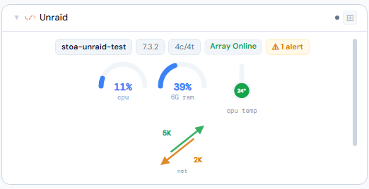
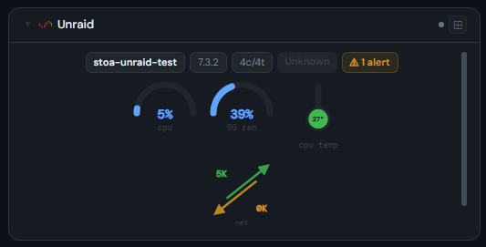
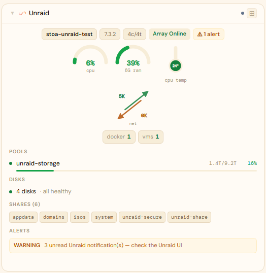
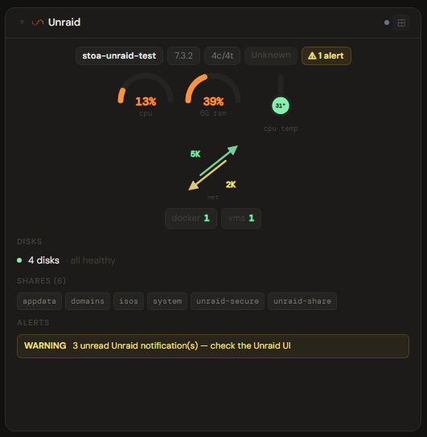

# Unraid

## What is Unraid?

Unraid is a NAS and application-server operating system built around a flexible, parity-protected array that lets you mix drive sizes and expand one disk at a time. Beyond storage it runs Docker containers and virtual machines, which makes it a popular all-in-one home-server OS.

**Official site:** [unraid.net](https://unraid.net)

---

## Getting the key

Stoa talks to Unraid's GraphQL API (`/graphql`), which authenticates with a dedicated API key — not your WebUI username/password. Generate one from the Unraid WebUI, under **Settings → Management Access → API Keys** (exact wording may vary slightly by Unraid version — look for an "API Keys" section under Management Access). Give it read access to system/array/docker/vm data.

- **Secret format:** API key only (not `username:password`)
- **URL:** required — point at your Unraid host, e.g. `http://192.168.1.10`

---

## Add it to Stoa

1. **Admin → Secrets → New** — paste the generated API key.
2. **Admin → Integrations → New** — select **Unraid**, enter the URL, choose the secret.
3. **Admin → Panels → New** — select **Unraid**.

---

## Panel

CPU, memory, and network are pushed live over a persistent WebSocket (GraphQL subscriptions) — expect updates every few seconds, not just on the usual polling interval. CPU temperature and read/write IOPS are included on the same live channel when available (see Notes — IOPS in particular is unconfirmed on most real setups). Storage shows as a **Pools** list — the main array (if it has any disks) plus each cache pool, each with used/total/percent — rather than a per-disk table; disk health is a one-line count ("N disks · all healthy" or "· N to check", naming only the ones worth a look) rather than a full list, by design — this is meant to be a glanceable summary, not a detailed disk inventory. Docker and VMs show as running/stopped counts, not container/VM lists. Shares are listed by name. An **Alerts** section surfaces anything synthesized from array/pool health, a failed parity check, disk-health issues, and Unraid's own unread-notification count — Unraid has no single unified alerts feed of its own.

### Height behavior

| Height | What you see |
|---|---|
| 1x | CPU/RAM (+ CPU temp if available) arcs only |
| 2-3x | Host pill + parity progress (if running) + arcs + net/IOPS + Pools + Docker/VM counts |
| 4x+ | All of the above + disk health summary + network interface list + shares + Alerts detail |

### Screenshots

| | Light | Dark |
|---|---|---|
| **1x** |  |  |
| **2x** |  |  |
| **4x** |  |  |

---

## Notes

Unraid's own GraphQL API (`unraid-api`, built into DSM 7.2+; the "Unraid Connect" plugin on older versions) turned out to be one of the roughest tested so far — several real bugs found, plus a few permanent gaps confirmed against real hardware, not just a VM:

- **Auth is an API key, not `username:password`.** Generate one in the Unraid WebUI under Settings → Management Access → API Keys. There's no CSRF/Origin token needed beyond the `x-api-key` header.
- **A single unavailable subsystem could wipe out the entire panel.** The original query bundled `docker`/`vms`/`shares` in with core system stats — `Docker.containers` (and the other two) are declared *non-nullable* in Unraid's schema, so when Docker isn't running (a normal, valid array/VM-only setup), GraphQL's null-propagation rules null out the *entire* response, not just the docker section — hostname, CPU, array, everything. Fixed by giving docker/vms/shares/notifications/disks each their own isolated query, so one missing subsystem can't take down the rest.
- **Several field names were wrong guesses**, all caught via Unraid's own (unusually blunt — a plain HTTP 400 with no field-level detail for a bad query) error responses: `info.version` doesn't exist (real field is `vars.version`); `info.cpu`/`info.memory` only expose static hardware specs, no live utilization at all (that only exists under a separate top-level `metrics`); there's no `network.iface` field (per-interface throughput is `metrics.network[]`, joined by name with `networkInterfaces` for IP, since no single type has both); `ArrayDisk.status` is a plain enum string, not an object with nested color/name fields; `ParityCheck` has no byte-count fields — `progress` is already a computed percent.
- **The live WebSocket subscriptions had their own, separate set of wrong field names** (`cpuUsage`/`iface` instead of the real `percentTotal`/flat `name,rxSec,txSec`) — caught the same way, via the subscription's own `error` message type, which the original code was silently discarding (logged only the message ID, not the actual reason). One of these bugs was worse than a clean error: `systemMetricsNetwork` returns a **list** of interfaces, not one object — the original single-object struct guess failed to unmarshal with *no error path at all*, so network stats just silently stopped updating with nothing in the logs to explain why.
- **Array vs. pool is a real distinction, and most home setups may be pool-only.** Unraid's parity-protected "array" requires 3+ disks in its own UI; a 2-disk setup can only be a "pool" (no parity). A pool's member disks come back from the API as separate per-slot rows with the *same* capacity numbers duplicated on each (not one row per pool), and the second+ member's name gets an auto-appended digit suffix (a 2-disk pool "tank" shows up as slots named `tank`/`tank2`). Stoa groups these back into one logical pool by matching capacity — there's no real pool-identity field in the API to key on instead — which is solid for a simple setup but could misgroup an unusual one (e.g. two different pools that happen to be the exact same size).
- **CPU temperature detection is best-effort and may not find every board's sensor.** Confirmed live on real hardware: an AMD system's actual CPU die sensor (the `k10temp` Linux driver) was classified by Unraid's own sensor-type system as generic `CUSTOM`, not `CPU_PACKAGE`/`CPU_CORE` — Stoa falls back to matching sensor names against known driver names (`k10temp`, `coretemp`), but a board using a different/less common sensor driver may still show nothing even though Unraid's own UI displays a temperature.
- **No disk I/O throughput (MB/s) or disk-busy% exists anywhere in this API** — confirmed by a full schema search, not just a missing field on one type. Raw IOPS (operations/sec, not the same thing) is theoretically derivable by diffing the `numReads`/`numWrites` counters, and Stoa does this live over a second, previously-unwired subscription (`arraySubscription`) rather than the slow poll, so a working setup would get genuine few-second resolution. **In practice, on real hardware tested (both an array-disk path and a pool-disk path), these counters never moved at all — always 0 — despite confirmed, active I/O.** The code is left in place (it degrades gracefully — the IOPS widget just doesn't render when both values are 0) in case a different Unraid version or configuration populates them correctly, but don't expect this to work today. Confirmed *not* an artifact of Stoa's polling: Unraid's own dashboard gets its live disk-activity graphs from a completely separate, older, undocumented WebSocket endpoint (`/sub/mymonitor`) that predates the GraphQL API — deliberately not reverse-engineered here, since it has no schema, no error visibility, and no stability guarantees across versions.
- **No ZFS ARC statistics are exposed anywhere in the schema either** — confirmed by the same full-schema search. A TrueNAS-style ARC/cache widget isn't buildable from this API.
- **`numErrors` is similarly unreliable for pool/cache-type disks.** Confirmed against a real drive with 896 genuine I/O errors (per Unraid's own UI) that the API reported as 0 — the same class of gap as the I/O-throughput one above, on the same device type.
