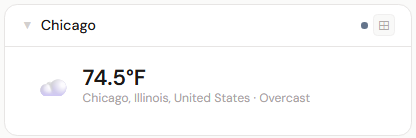
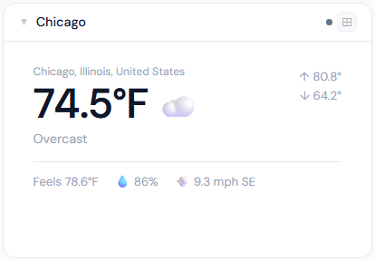
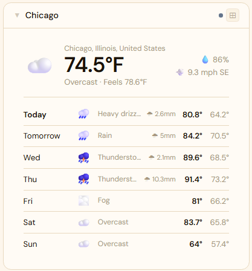

# Weather

**Category:** Content | **Status:** Tested | **Polling:** 10 min

---

## Integration

**Secret format:** Blank - no API key needed

> Open-Meteo is a public API with no authentication required.

**URL required:** None (Open-Meteo public API)

### Setup

1. Admin -> Integrations -> New: type Weather, no URL, no secret
2. Admin -> Panels -> New: type Weather - configure location (city name or lat/long) and temperature unit in panel config

---

## Panel

Current conditions (temperature, feels-like, wind, humidity) and a multi-day forecast. Sourced from Open-Meteo.

### Height behavior

| Height | What you see |
|---|---|
| 1x | Current temp + conditions + feels-like |
| 2-3x | Current conditions + 3-day forecast |
| 4x+ | Full current detail + 7-day forecast + hourly chart |

### Screenshots

| 1x | 2x | 4x |
|---|---|---|
|  |  |  |

*Screenshots pending - add as screenshots/1x.png, screenshots/2x.png, screenshots/4x.png.*
---

## Notes

Configure location by city name (e.g. Denver, CO) or latitude/longitude in the panel config.