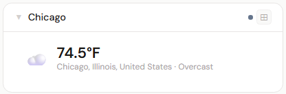
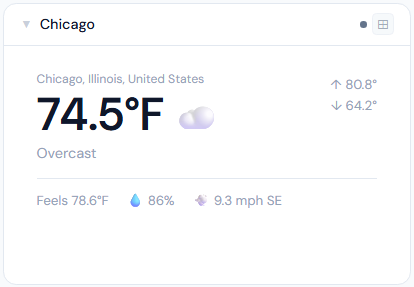
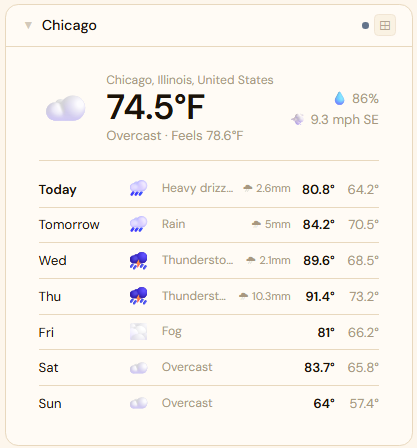

# Weather

## What is Weather?

Weather is a built-in Stoa feature — not a self-hosted app you deploy — showing current conditions and a multi-day forecast, sourced from the free public Open-Meteo API. No key is needed; you set a location per panel.

**Data source:** [open-meteo.com](https://open-meteo.com)

---

## Getting the key

None — Open-Meteo is a public API with no authentication required.

- **Secret format:** none
- **URL:** none (Open-Meteo public API)

---

## Add it to Stoa

1. **Admin → Integrations → New** — select **Weather**, no URL, no secret.
2. **Admin → Panels → New** — select **Weather**, and configure the location (city name or lat/long) and temperature unit in the panel config.

---

## Panel

Current conditions (temperature, feels-like, wind, humidity) and a multi-day forecast. Sourced from Open-Meteo.

### Height behavior

| Height | What you see |
|---|---|
| 1x | Current temp + conditions + feels-like |
| 2-3x | Current conditions + 3-day forecast |
| 4x+ | Full current detail + 7-day forecast + hourly chart |

### Screenshots

| 1x | 2x | 4x |
|---|---|---|
|  |  |  |

*Screenshots pending - add as screenshots/1x.png, screenshots/2x.png, screenshots/4x.png.*

---

## Notes

Configure location by city name (e.g. Denver, CO) or latitude/longitude in the panel config.
