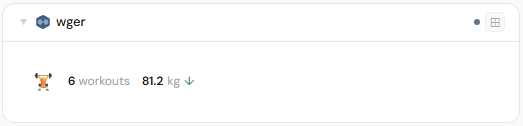
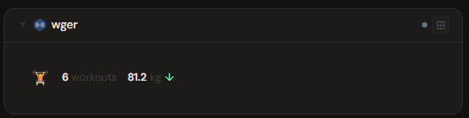
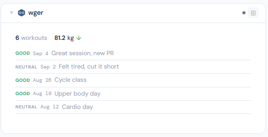
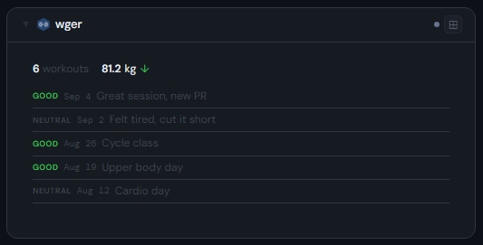
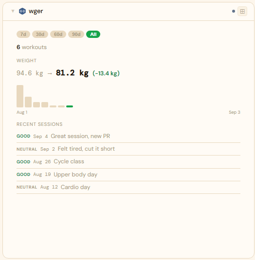
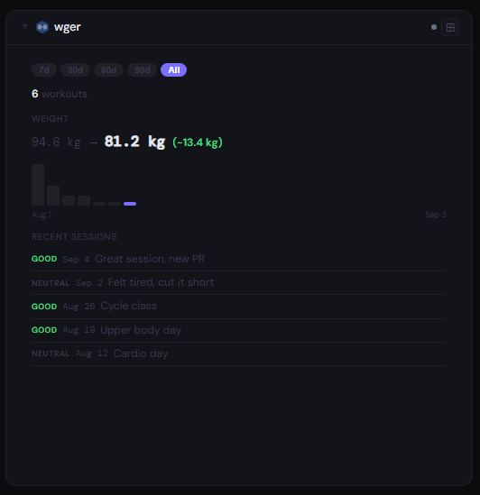

# wger

## What is wger?

wger is a self-hosted workout manager and fitness tracker. It lets you plan workout routines, log training sessions, track body weight and nutrition, and browse an exercise database — an open-source alternative to commercial fitness apps.

**Official site:** [wger.de](https://wger.de)

---

## Getting the key

wger → **Dashboard → API → Permanent API key** — copy it.

- **Secret format:** plain API key
- **URL:** required — point at your wger port, e.g. `http://192.168.1.10:80`

---

## Add it to Stoa

1. **Admin → Secrets → New** — paste the key.
2. **Admin → Integrations → New** — select **wger**, enter the URL, choose the secret.
3. **Admin → Panels → New** — select **wger**.

---

## Panel

Workout manager panel — total workout count, recent session log (impression, notes, date), and a weight history chart. Weight is displayed in whatever unit your wger account's profile is set to (kg or lb) — Stoa mirrors it rather than forcing one. At 4x+, a time-range pill selector (7d/30d/60d/90d/All) recomputes the chart and session list live for that period, leading with a "start → now" figure (e.g. "94.6 → 81.2 lb (−13.4 lb)") plus a properly-sized bar chart, rather than a plain list of numbers.

### Height behavior

| Height | What you see |
|---|---|
| 1x | Total workouts + latest weight with trend arrow |
| 2-3x | Same + recent session list |
| 4x+ | Time-range pills + start→now weight chart + session list |

### Screenshots

| | Light | Dark |
|---|---|---|
| **1x** |  |  |
| **2x** |  |  |
| **4x** |  |  |

---

## Notes

**Session dates**: the released `wger/server` image still uses a bare `date` field (`YYYY-MM-DD`) on workout sessions. wger's `master` branch on GitHub already has an unreleased migration to `datetime_start`/`datetime_end` — Stoa reads `datetime_start` first and falls back to `date`, so this keeps working across that eventual upgrade without another fix.

**Impression scale** is 3 values (`1`=Bad, `2`=Neutral, `3`=Good) on current wger, not a 5-value scale.

**Creating sessions via the API directly** (e.g. if your instance's static files aren't being served and the web UI's session-logging form doesn't render): POST to `/api/v2/workoutsession/` with `{"date": "2026-08-20", "impression": "3", "notes": "..."}` — no routine/day reference required, those are optional on the model despite the web UI routing you through one. Get a token without needing the UI at all via `docker exec -it <container> ./manage.py drf_create_token <username>` (a standard Django REST Framework management command).
