# YouTube

**Category:** Content | **Status:** Tested | **Polling:** 60 min

---

## Integration

**Secret format:** `clientId:clientSecret`

> OAuth 2.0 credentials from Google Cloud Console, colon-separated: `1234567890-abc.apps.googleusercontent.com:GOCSPX-yourSecret`

**URL required:** None — Stoa calls the YouTube Data API v3 directly.

### Google Cloud Console setup

> **Already have a Google Calendar integration?** You can add YouTube to the same Google Cloud project — just enable the YouTube Data API v3 on the existing project and add the YouTube redirect URI to the same OAuth client. Skip to step 4.

1. Go to [console.cloud.google.com](https://console.cloud.google.com) → **Select a project** → **New Project** (or open your existing Stoa project)
2. **APIs & Services → Library** → search **YouTube Data API v3** → **Enable**
3. **APIs & Services → Credentials → Create Credentials → OAuth 2.0 Client ID**
   - Application type: **Web application**
   - Under **Authorized redirect URIs**, add: `https://your-stoa-domain/api/youtube/callback`
   - Click **Create**, copy the **Client ID** and **Client Secret**
4. Format the secret as `clientId:clientSecret` (no spaces)

> **Redirect URI must be publicly routable.** Google does not allow `http://` for non-localhost redirect URIs. If your Stoa instance is on an internal hostname (e.g. `stoa.home`), use a public domain that reverse-proxies to it, or use a public Stoa instance for the OAuth step and revert afterward.

> **Google OAuth consent screen:** The first time you connect, Google will show a consent screen and may display an "unverified app" warning. This is expected for personal Google Cloud projects. Click **Advanced → Go to [app] (unsafe)** to proceed — this is your own app connecting to your own account.

### Stoa setup

1. Stoa → **Admin → Secrets → New**: paste `clientId:clientSecret`
2. Stoa → **Admin → Integrations → New** → select **YouTube**, select the secret → **Save**
   - No URL is required; leave it blank
3. On the integration edit page, click **Connect YouTube** → complete the Google OAuth consent flow → you will be redirected back to Stoa
4. The integration edit page should now show your channel name confirming the connection
5. Stoa → **Admin → Panels → New** → select **YouTube**, select the integration → **Create**

> **Personal integrations:** Non-admin users can create YouTube integrations from their profile page under **My Integrations**. The OAuth connect flow works identically.

---

## Panel

Subscription feed showing recent videos from channels you follow. Videos are sorted by publish date — newest first. Click any video to watch it inline via an embedded player with full-screen support. Use the **← Back** button to return to the feed.

The feed is cached server-side for 55 minutes. Stoa fetches your top 25 subscriptions by relevance, pulls the 3 most recent uploads per channel, and returns the 30 newest across all of them.

### Height behavior

| Height | What you see |
|---|---|
| 1x | Latest video — title, channel name, age |
| 2x | Header + 3 most recent videos as compact rows |
| 3x | Header + 7 most recent videos as compact rows |
| 4x | Header + 1 featured hero thumbnail (latest) + scrollable list of remaining videos |
| 5x+ | Header + 2 side-by-side hero thumbnails + scrollable list of remaining videos |

### Video player

Clicking any video or thumbnail opens an inline YouTube embed within the panel. The player supports fullscreen via YouTube's native button. Clicking **← Back** dismisses the player and returns to the feed at any panel size.

### Screenshots

| | Dark | Light |
|---|---|---|
| **1x** | 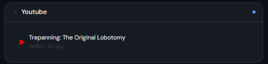 | 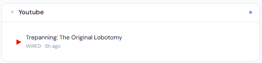 |
| **2x** | 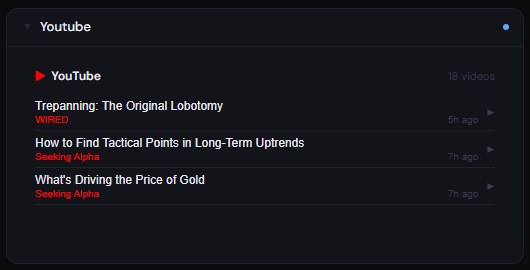 | 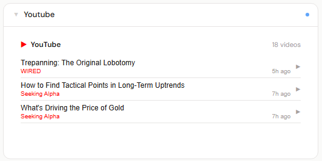 |
| **3x** | 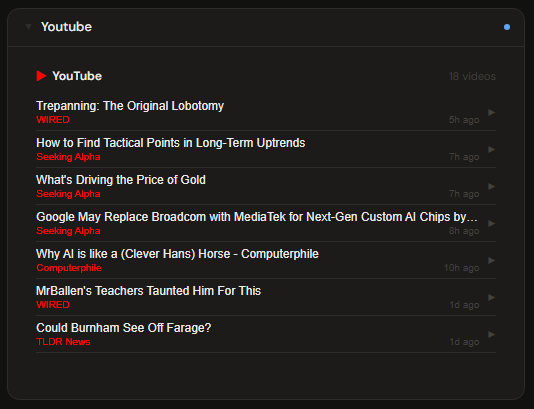 | 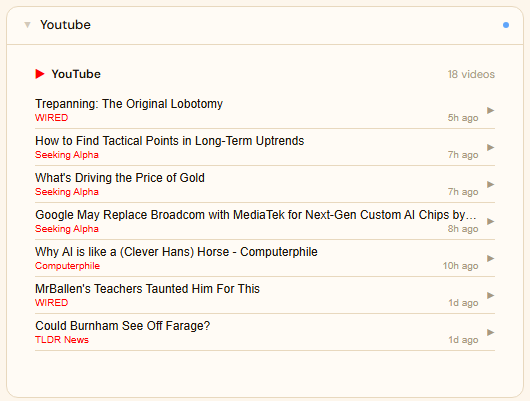 |
| **4x** | 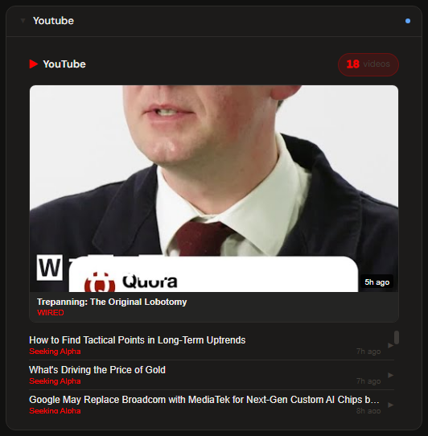 | 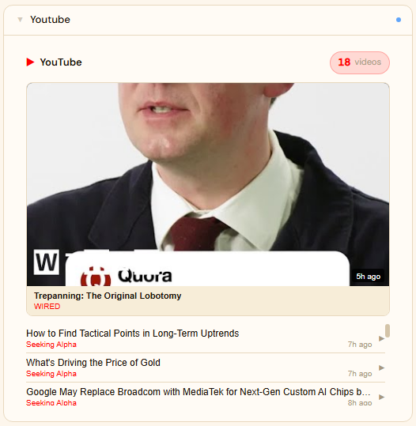 |
| **5x** | 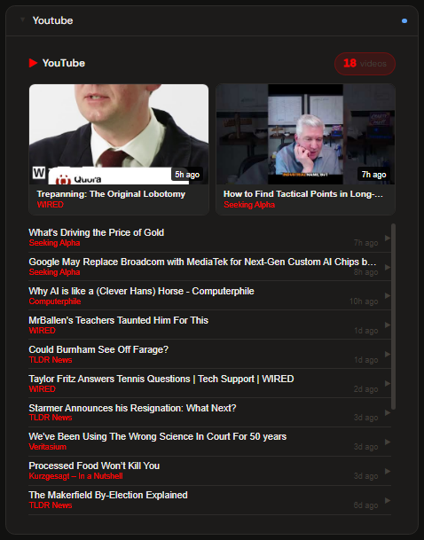 | 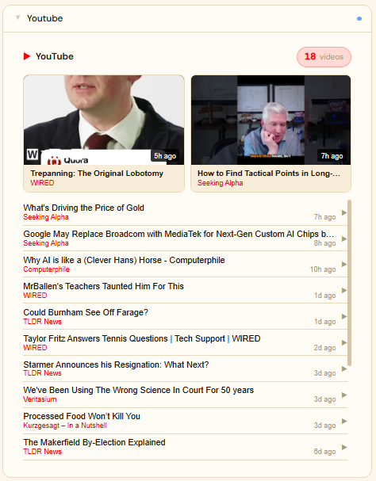 |
| **Playing** | 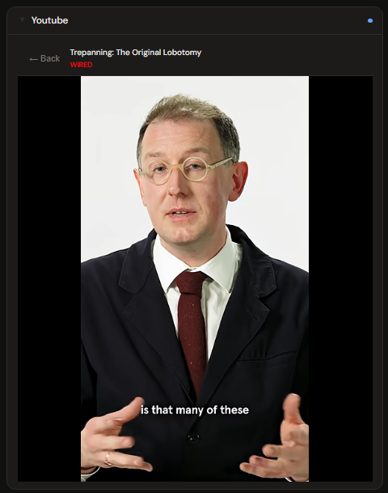 | 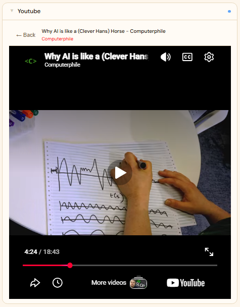 |

---

## Notes

- **Quota:** YouTube Data API v3 free tier is 10,000 units/day. Stoa uses ~27 units per feed refresh. At the default 60-minute poll interval that is ~648 units/day — well within the free limit
- **Feed source:** Videos come from your YouTube subscriptions, not recommendations. Channels you are not subscribed to will not appear
- **Curating the feed:** Subscribe only to the channels you want to see in Stoa. The feed refreshes within 55 minutes; to force an immediate refresh, disconnect and reconnect the integration
- **Token refresh:** Access tokens are refreshed automatically when they approach expiry — no manual re-authorization needed
- **Shared vs personal:** YouTube integrations can be created as system-wide (admin) or personal (per-user). Each user connecting their own account needs their own integration and OAuth authorization
